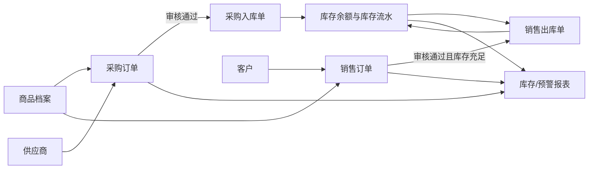

# ERP 进销存后续模块 PRD

| 项目 | 内容 |
| --- | --- |
| 文档版本 | V0.2（评审稿） |
| 适用范围 | 当前 ERP 商品档案样例的下一阶段 |
| 产品目标 | 建立采购、销售、仓库、业务报表和系统设置的最小闭环 |
| 技术前提 | Vue 3 + Spring Boot 3.4 + Maven + JDK 17 + MySQL 8 |
| 状态 | 待业务评审，评审后作为开发基线 |

## 1. 背景与现状

当前项目已经完成“商品档案管理”垂直样例：商品可新增、编辑、启停、筛选、导出，并可看到安全库存预警。后端目前使用内存数据；页面中的“快速补货”直接修改商品库存，仅用于演示，不能满足真实业务的单据、审核、追溯和多人协作要求。

下一阶段的目标不是一次性实现完整财务 ERP，而是建设一个可运行的进销存闭环：**采购订单到货入库 → 库存变化 → 销售订单出库 → 经营与库存报表**。所有库存变化均应有来源单据和流水。

## 2. 产品目标与范围

### 2.1 本期目标（V1）

1. 用 MySQL 保存商品、供应商、客户、仓库、单据和库存流水。
2. 采购人员可创建、提交采购订单；仓库人员可按已审核采购单完成入库。
3. 销售人员可创建、审核销售订单；仓库人员可按已审核销售单完成出库。
4. 系统实时维护“商品 + 仓库”维度的可用库存，不允许无来源直接改库存。
5. 管理人员可查看采购、销售、库存和预警报表，并导出 CSV。
6. 以简单账号、角色、权限控制菜单与接口访问。

### 2.2 本期不包含

- 财务凭证、发票、应收应付、成本核算和税务处理。
- 多组织、多币种、多语言、复杂促销及客户信用额度。
- 移动端、扫码枪、PDA、第三方电商/物流接口。
- 多级审批流、电子签章和消息中心；V1 采用单级审核。
- 批次、序列号、保质期、库位精细管理；作为仓库 V2 能力。

## 3. 用户角色与权限边界

| 角色 | 主要权限 | 不应拥有的权限 |
| --- | --- | --- |
| 系统管理员 | 用户、角色、基础设置、所有数据查询 | 不能绕过业务单据直接修改库存 |
| 采购员 | 供应商查看、采购订单创建/编辑/提交、采购报表查看 | 采购订单审核、实际入库、系统设置 |
| 采购主管 | 采购订单审核/驳回、采购报表查看 | 实际入库、用户管理 |
| 销售员 | 客户查看、销售订单创建/编辑/提交、销售报表查看 | 销售订单审核、实际出库、系统设置 |
| 销售主管 | 销售订单审核/驳回、销售报表查看 | 实际出库、用户管理 |
| 仓库管理员 | 入库、出库、调拨、盘点、库存查询与库存报表查看 | 单据价格修改、业务单据审核、用户管理 |
| 经营管理者 | 全部报表与单据只读查询 | 创建、审核、出入库、系统设置 |

> V1 可以先用预置账号演示角色。正式开发时，前端菜单隐藏不等于权限控制，后端接口必须再次校验角色权限。

## 4. 核心业务对象与依赖关系

| 对象 | 关键字段 | 来源/依赖 |
| --- | --- | --- |
| 商品 | 编码、名称、分类、单位、销售价、安全库存、启用状态 | 已有商品档案，需迁移到 MySQL |
| 供应商 | 编码、名称、联系人、电话、状态 | 采购订单引用 |
| 客户 | 编码、名称、联系人、电话、状态 | 销售订单引用 |
| 仓库 | 编码、名称、负责人、状态 | 库存、入库、出库引用 |
| 采购订单 | 单号、供应商、订单日期、状态、明细 | 审核后可生成采购入库 |
| 销售订单 | 单号、客户、订单日期、状态、明细 | 审核后可生成销售出库 |
| 库存余额 | 商品、仓库、现存数量、锁定数量、可用数量 | 由库存流水汇总/同步维护 |
| 库存流水 | 流水号、商品、仓库、业务类型、变动数量、来源单号、操作人、时间 | 所有库存变化的审计依据 |



## 5. 统一单据状态与通用规则

### 5.1 单据状态

| 状态 | 含义 | 可执行动作 |
| --- | --- | --- |
| 草稿 | 创建人尚未提交 | 编辑、删除、提交 |
| 待审核 | 已提交等待主管处理 | 审核通过、驳回 |
| 已审核 | 已通过业务审核 | 采购单可入库；销售单可出库 |
| 已完成 | 对应入库/出库数量全部完成 | 查看、导出 |
| 已驳回 | 审核不通过 | 修改后重新提交 |
| 已作废 | 不再继续执行 | 查看、导出 |

### 5.2 通用业务规则

1. 单号由系统生成，格式建议为 `POyyyyMMdd-序号`、`SOyyyyMMdd-序号`、`INyyyyMMdd-序号`、`OUTyyyyMMdd-序号`，不可重复。
2. 草稿和已驳回单据可编辑；待审核、已审核、已完成单据不可直接修改明细。
3. 商品、供应商、客户、仓库为停用状态时，不允许在新单据中选择；历史单据仍可正常查看。
4. 数量必须大于 0，单价不得小于 0；金额 = 数量 × 单价，保留两位小数。
5. 库存只允许通过已完成的入库、出库、调拨、盘点调整单变化。商品档案中的库存字段改为只读展示值。
6. 出库前校验可用库存；V1 不允许负库存。若库存不足，应提示商品、仓库、可用库存与缺口数量。
7. 每次库存变化生成一条不可修改的库存流水，保留来源单号、操作人和操作时间。
8. 审核、作废、完成等关键操作需记录操作日志；作废已完成单据不能直接回滚库存，必须创建对应红字/退货单（V2）。

## 6. 采购管理

### 6.1 业务目标

采购人员根据缺货预警或业务需求创建采购订单，采购主管审核，仓库依据审核通过的订单登记实际到货并入库，从而补充库存。

### 6.2 页面与功能需求

| 编号 | 功能 | 需求说明 | 优先级 |
| --- | --- | --- | --- |
| PUR-01 | 供应商列表 | 支持供应商编码、名称、联系人、电话、状态查询；管理员可新增、编辑、启停 | Must |
| PUR-02 | 采购订单列表 | 按单号、供应商、日期、状态筛选；展示订单数量、金额、已入库数量、创建人 | Must |
| PUR-03 | 新建采购订单 | 选择启用供应商和商品，填写采购数量、含税单价、预计到货日期、备注；自动计算金额 | Must |
| PUR-04 | 提交与审核 | 采购员提交；采购主管可审核通过或驳回，驳回必须填写原因 | Must |
| PUR-05 | 采购入库 | 仓库人员从已审核采购单创建入库单，可填写本次实收数量和入库仓库；支持分批入库 | Must |
| PUR-06 | 到货差异 | 实收数量与订单数量不一致时，显示未入库数量；订单全部收货后自动变为已完成 | Should |
| PUR-07 | 采购退货 | 对已入库商品创建采购退货出库单，并关联原入库单 | Won't（V2） |

### 6.3 采购入库规则

1. 只有“已审核”的采购订单可发起采购入库。
2. 单次入库数量不得超过该订单行的未入库数量；允许一次订单多次入库。
3. 入库完成后：库存余额增加、生成“采购入库”流水、回写订单已入库数量。
4. 若订单全部明细均已足量入库，采购订单状态变为“已完成”。

### 6.4 采购验收标准

- 创建并审核一张含两种商品的采购订单后，仓库可在入库页面查询到该订单。
- 对其中一项分两次入库，库存增加量等于两次实收数量之和，且存在两条可追溯流水。
- 对未审核、已完成或停用商品，系统不得允许创建入库。

## 7. 销售管理

### 7.1 业务目标

销售人员为客户创建销售订单，销售主管审核后，由仓库按订单发货出库；系统防止超卖并沉淀销售数据。

### 7.2 页面与功能需求

| 编号 | 功能 | 需求说明 | 优先级 |
| --- | --- | --- | --- |
| SAL-01 | 客户列表 | 支持客户编码、名称、联系人、电话、状态查询；管理员可新增、编辑、启停 | Must |
| SAL-02 | 销售订单列表 | 按单号、客户、日期、状态筛选；展示数量、金额、已出库数量、创建人 | Must |
| SAL-03 | 新建销售订单 | 选择启用客户、商品和发货仓库；填写销售数量、成交单价、要求发货日期、备注 | Must |
| SAL-04 | 可用库存提示 | 选择商品和仓库后显示可用库存；保存、提交、出库均需后端再次校验 | Must |
| SAL-05 | 提交与审核 | 销售员提交；销售主管审核通过或驳回，驳回填写原因 | Must |
| SAL-06 | 销售出库 | 仓库人员按已审核销售单创建出库单；支持分批出库 | Must |
| SAL-07 | 销售退货 | 对已出库商品登记退货入库并关联原出库单 | Won't（V2） |

### 7.3 销售出库规则

1. 只有“已审核”的销售订单可发起销售出库。
2. 系统在创建出库单与确认出库两个时点都校验库存，防止并发操作超卖。
3. V1 不做预占库存；订单审核不扣库存，实际确认出库时扣减库存。页面须提示“库存以出库时为准”。
4. 出库完成后：库存余额减少、生成“销售出库”流水、回写订单已出库数量。
5. 若所有明细均已出库，销售订单状态变为“已完成”。

### 7.4 销售验收标准

- 库存充足时，审核后的销售订单可成功出库，库存和库存流水正确变化。
- 库存不足时，系统拒绝确认出库，且库存不发生变化。
- 同一销售订单可分批出库，订单仅在全部数量完成后变为“已完成”。

## 8. 仓库管理

### 8.1 业务目标

将库存从商品档案中的静态数字升级为可按仓库查询、可追溯来源、可盘点调整的业务数据。

### 8.2 页面与功能需求

| 编号 | 功能 | 需求说明 | 优先级 |
| --- | --- | --- | --- |
| WH-01 | 仓库设置 | 管理仓库编码、名称、负责人、地址、状态；至少预置“主仓” | Must |
| WH-02 | 库存余额表 | 按商品、仓库、分类、库存状态筛选；显示现存、锁定、可用、安全库存、预警状态 | Must |
| WH-03 | 库存流水表 | 按商品、仓库、业务类型、来源单号、日期筛选；可查看每笔增减原因和操作人 | Must |
| WH-04 | 入库单列表/详情 | 查看采购入库记录及明细；确认入库后不可编辑 | Must |
| WH-05 | 出库单列表/详情 | 查看销售出库记录及明细；确认出库后不可编辑 | Must |
| WH-06 | 库存调拨 | 主仓与其他仓之间调拨，调出与调入同时生成流水 | Should |
| WH-07 | 盘点调整 | 创建盘点单，录入账面数与实盘数，主管审核后生成盘盈/盘亏流水，必须填写原因 | Should |
| WH-08 | 批次/库位管理 | 按批次、货位、效期维护库存 | Won't（V2） |

### 8.3 库存计算口径

| 指标 | 计算规则 |
| --- | --- |
| 现存数量 | 已确认入库数量 − 已确认出库数量 ± 已确认调整数量 |
| 锁定数量 | V1 固定为 0；V2 在销售订单审核后实现预占 |
| 可用数量 | 现存数量 − 锁定数量 |
| 低库存 | 同一商品在所有启用仓库的可用数量之和 < 商品安全库存 |
| 库存货值 | V1 以商品维护的参考单价 × 现存数量估算，不作为财务成本 |

### 8.4 仓库验收标准

- 可从库存余额追溯到对应采购入库或销售出库流水。
- 同一商品在不同仓库分别统计，不得混合数量。
- 已确认的出入库单不可再次确认，重复请求不得重复扣增库存。

## 9. 业务报表

### 9.1 业务目标

让经营管理者不进入单据详情也能了解采购、销售、库存及异常情况。V1 以实时查询和 CSV 导出为主，不建设离线数仓。

### 9.2 报表清单

| 编号 | 报表 | 核心指标/维度 | 优先级 |
| --- | --- | --- | --- |
| RPT-01 | 经营看板 | 本月采购金额、销售金额、入库数量、出库数量、低库存商品数、近 7 日趋势 | Must |
| RPT-02 | 采购分析 | 按日期、供应商、商品、分类统计采购数量、金额、已入库数量 | Must |
| RPT-03 | 销售分析 | 按日期、客户、商品、分类统计销售数量、金额、已出库数量 | Must |
| RPT-04 | 库存余额报表 | 按仓库、商品、分类展示现存、可用、安全库存、预警状态、参考货值 | Must |
| RPT-05 | 库存收发存报表 | 指定日期范围内展示期初、入库、出库、调整、期末数量 | Should |
| RPT-06 | 预警报表 | 展示低库存、缺货、停用但有库存的商品 | Should |
| RPT-07 | 排行榜 | 销售金额/数量 Top 10，采购金额 Top 10 | Should |

### 9.3 报表通用规则

1. 所有报表默认展示当前自然月，允许选择日期范围；日期范围最长 366 天。
2. 统计以“已完成”的出入库单与库存流水为准，草稿、待审核和已驳回单据不计入。
3. 金额单位为人民币，显示两位小数；数量保留业务单位。
4. 每张报表均支持按当前筛选条件导出 UTF-8 CSV；导出列与页面列表一致。
5. 页面需要标明数据刷新时间与统计口径，避免将参考货值误解为财务成本。

### 9.4 报表验收标准

- 新完成一笔采购入库后，库存余额和采购报表应在刷新后体现该数据。
- 新完成一笔销售出库后，销售金额、出库数量、库存余额应互相一致。
- 导出 CSV 的记录数和页面当前筛选结果一致。

## 10. 系统设置

### 10.1 业务目标

维护所有业务单据共同依赖的基础资料和访问权限，避免将仓库、客户、供应商等配置硬编码在前端。

### 10.2 页面与功能需求

| 编号 | 功能 | 需求说明 | 优先级 |
| --- | --- | --- | --- |
| SET-01 | 登录与当前用户 | 用户使用账号密码登录；页面展示当前用户、角色与退出入口 | Must |
| SET-02 | 用户管理 | 管理员可创建、启停、重置密码用户；用户名唯一 | Must |
| SET-03 | 角色权限 | 至少支持管理员、采购员、采购主管、销售员、销售主管、仓库管理员、经营管理者；按菜单和接口授权 | Must |
| SET-04 | 仓库管理 | 维护仓库主数据，供采购入库、销售出库和库存查询使用 | Must |
| SET-05 | 供应商管理 | 维护供应商主数据，供采购订单使用 | Must |
| SET-06 | 客户管理 | 维护客户主数据，供销售订单使用 | Must |
| SET-07 | 商品分类与单位 | 维护商品分类、计量单位；商品表单下拉选择，避免自由文本不一致 | Should |
| SET-08 | 单据编号规则 | V1 系统内置固定格式；后续可在设置页配置前缀与序号 | Won't（V2） |
| SET-09 | 操作日志 | 查询登录、审核、作废、出入库、盘点等关键操作 | Should |

### 10.3 安全与数据规则

1. 密码不得明文保存；后端使用强哈希存储，接口不得返回密码字段。
2. 被停用用户不能登录；被停用角色不应保留可访问菜单和接口。
3. 系统管理员不能删除已被单据引用的主数据，只能停用。
4. 系统初始数据需至少包含：一个管理员、一个主仓、一个采购员、一个销售员、一个仓库管理员，以及若干商品、供应商、客户。

## 11. 页面导航建议

```text
首页 / 经营看板
├─ 基础资料
│  ├─ 商品档案（已完成，后续改为库存只读）
│  ├─ 供应商
│  ├─ 客户
│  └─ 仓库
├─ 采购管理
│  ├─ 采购订单
│  └─ 采购入库
├─ 销售管理
│  ├─ 销售订单
│  └─ 销售出库
├─ 仓库管理
│  ├─ 库存余额
│  ├─ 库存流水
│  ├─ 调拨管理
│  └─ 盘点管理
├─ 业务报表
│  ├─ 采购分析
│  ├─ 销售分析
│  ├─ 库存报表
│  └─ 预警报表
└─ 系统设置
   ├─ 用户与角色
   └─ 操作日志
```

## 12. V1 范围与实施顺序

| 版本 | 目标 | 交付内容 |
| --- | --- | --- |
| V1 | 可持久化的进销存闭环 | MySQL、登录/RBAC、商品/客户/供应商/仓库主数据、采购订单与入库、销售订单与出库、库存余额/流水/预警、经营看板、采购/销售/库存报表、CSV 导出、调拨、盘点、操作日志 |
| V2 | 复杂业务能力 | 退货、预占、批次/库位、审批流、财务与第三方集成 |

V1 包含本 PRD 中所有标记为 **Must** 和 **Should** 的需求；仅明确标记为 `Won't（V2）` 的需求不纳入 V1。推荐在同一 V1 内按以下顺序实施：数据库与权限底座 → 采购入库 → 销售出库 → 库存调拨/盘点 → 经营与业务报表 → 操作日志。不得先开发报表页面再补单据和库存流水，否则报表数据没有可信来源。

## 13. 数据与技术约束

1. 当前内存商品数据需要迁移为 MySQL 表，后端重启后数据不得丢失。
2. 商品编码、供应商编码、客户编码、仓库编码、用户名、单据号均需数据库唯一约束。
3. 金额使用 `BigDecimal`；数量使用整数或明确的小数精度，不能用 `float/double` 做金额结算。
4. 库存扣减、库存流水写入、单据完成状态更新必须在同一数据库事务中完成。
5. API 需返回统一错误结构，至少包含错误码、用户可读消息和字段错误信息。
6. 删除商品前需判断是否已有库存、库存流水或业务单据引用；有引用时只允许停用。
7. 前端路由、菜单和按钮按权限展示；后端接口仍为最终权限边界。

## 14. 关键验收场景（端到端）

| 编号 | 场景 | 操作 | 预期结果 |
| --- | --- | --- | --- |
| E2E-01 | 采购入库 | 创建采购单 → 提交 → 审核 → 分两次入库 | 库存累计增加、两条流水可追溯、订单最终完成 |
| E2E-02 | 销售出库 | 创建销售单 → 审核 → 出库 | 库存减少、销售报表增加、订单完成 |
| E2E-03 | 防止超卖 | 创建数量大于可用库存的销售出库 | 系统拒绝出库，库存和流水不变化 |
| E2E-04 | 权限隔离 | 采购员尝试审核采购单或访问用户管理接口 | 页面无按钮，接口返回无权限 |
| E2E-05 | 低库存预警 | 出库后可用库存低于安全库存 | 商品档案、库存余额、预警报表均显示预警 |
| E2E-06 | 报表一致性 | 完成一笔采购入库和一笔销售出库 | 单据、库存流水、库存余额、采购/销售报表数据一致 |
| E2E-07 | 数据持久化 | 重启后端服务 | 商品、单据、库存和报表数据保持不变 |

## 15. 待业务确认项

以下问题会影响字段、流程和排期，需要在开发前由业务方确认：

1. 商品数量是否允许小数（例如 1.5 千克），还是全部使用整数？
2. 是否存在多个仓库；若有，销售订单由谁选择发货仓库？
3. 采购与销售单价是否含税；V1 是否仅维护一个不含税/含税价格？
4. 采购、销售审核是否均为单级主管审核？
5. 是否允许订单部分收货、部分发货？本 PRD 默认允许。
6. 是否需要销售退货、采购退货、调拨和盘点在课程成果中展示？
7. 报表以自然月还是自定义经营周期作为默认统计范围？

## 16. 本次评审结论模板

评审时请重点确认：

- V1 的最小闭环是否采用“采购订单 → 入库 → 库存 → 销售订单 → 出库”。
- 是否认可 V1 不做财务、退货、批次/库位及复杂审批。
- 是否认可库存只由已确认的业务单据驱动，不允许在商品档案中直接修改。
- 是否确认上述角色、单据状态、库存不足处理和报表口径。

确认后，将本文件版本号升级为 V1.0，并以需求编号作为开发任务、接口测试和验收用例的共同索引。
