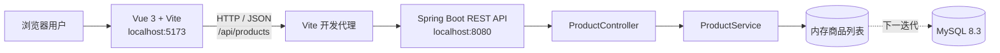

# ERP 项目：商品档案管理最小样例

本仓库是 ERP 项目实训的起点。目前完成了一个可运行的“商品档案 + 采购管理”垂直切片，用来验证 **Vue 3 前端 → HTTP/JSON → Spring Boot REST API** 的前后端分离开发方式。

样例对应课程 PPT 中“进销存系统”的商品基础档案与采购业务能力。当前版本支持商品增删改查、安全库存预警、供应商管理、采购订单创建/提交/审核/驳回、采购入库、到货进度、库存更新和 CSV 导出。

> 本 README 按《课程规划.pptx》要求的企业真实流程组织：业务提需求 → MRD → MRD 评审 → PRD → PRD 评审 → 开发文档 → 排期 → 开发与测试用例 → 自测冒烟 → 测试环境 → 测试执行 → 预发/灰度 → 上线。这个样例是流程演练，不冒充完整生产系统；未完成的阶段均明确标出。

## 1. 当前成果与运行状态

| 项目 | 当前结果 |
| --- | --- |
| 前端 | 企业 ERP 风格 Vue 3 页面，支持筛选、排序、详情、补货、启停、复制与导出 |
| 后端 | Spring Boot REST API，提供商品与采购管理接口 |
| 数据 | 当前商品、供应商、采购订单和入库数据保存在后端内存中，重启后恢复演示数据 |
| 构建 | `mvn test`、`mvn package -DskipTests`、`npm run build` 均已通过 |
| 联调 | 前端代理 `/api` 到后端，商品与采购页面均可调用接口 |
| 接口冒烟 | 商品查询、供应商查询、采购订单、部分入库和库存更新已实际调用通过 |
| MySQL | 环境已安装，但本样例尚未接入数据库 |
| 部署 | 仅本机开发环境，尚未发布到测试服务器或公网 |

本机服务地址：

- 前端：<http://localhost:5173>
- 后端接口：<http://localhost:8080/api/products>

## 2. 为什么先做这个小样例

完整 ERP 包含基础维护、CRM、进销存、业务报表、仓储、定时任务和财务七大子系统。直接同时开发所有模块风险很高，因此先选择“商品档案管理”做最小垂直切片，验证以下关键链路：

1. JDK、Maven、Node.js、npm、Git、VS Code 是否能协同工作。
2. Vue 页面能否调用 Spring Boot 接口。
3. RESTful 接口结构、输入校验和错误状态是否可行。
4. 前后端目录、构建命令和联调方式是否适合后续扩展。
5. 先让团队看到一个可操作结果，再评审界面与工程方向。

采购垂直切片验证通过后，再将同一套方法扩展到销售单、出库、库存报表等核心业务。

---

# 第一部分：需求与产品阶段

## 3. 节点 1——业务提出需求

### 3.1 业务背景

采购、销售和仓库都会使用商品信息。如果商品编码、名称、分类、单位、价格和库存规则分散维护，会造成以下问题：

- 同一个商品出现多个编码或名称，采购、销售和仓库无法对齐。
- 业务人员无法快速查询商品当前库存。
- 库存低于安全线时没有明显提醒，容易缺货。
- 后续采购单、销售单和出入库单缺少统一商品来源。

### 3.2 业务目标

建立一个统一的商品档案入口，让业务人员能够查看和维护商品基础信息，并直观看到库存预警状态。

### 3.3 原始业务诉求

业务人员希望系统能够：

1. 查看所有商品及其编码、分类、价格和库存。
2. 按商品名称、编码或分类搜索。
3. 新增和修改商品档案。
4. 删除不需要的演示商品。
5. 当当前库存低于安全库存时给出醒目标识。

### 3.4 初始验收想法

- 页面可以正常打开并展示默认商品。
- 新增商品后无需刷新即可在列表中看到。
- 编辑后列表显示最新数据。
- 删除后商品从列表消失。
- 低于安全库存的商品有明显预警颜色。
- 重复商品编码不能成功创建。

**节点产出物：**业务需求描述、业务目标、初始验收标准。

## 4. 节点 2——MRD（市场/业务需求文档）

课程项目没有真实商业客户，因此这里把 MRD 简化为“业务价值与范围论证”，用于回答“为什么做、先做什么”。

### 4.1 目标用户

- 商品资料管理员
- 采购人员
- 销售人员
- 仓库管理员
- 项目演示与验收人员

### 4.2 用户价值

| 用户 | 价值 |
| --- | --- |
| 商品资料管理员 | 在同一入口维护统一商品信息 |
| 采购/销售人员 | 后续创建业务单据时使用同一商品编码 |
| 仓库管理员 | 快速查看库存与安全库存差异 |
| 项目团队 | 验证前后端分离架构和协作方法 |

### 4.3 本期范围（MVP）

- 商品列表
- 模糊搜索
- 新增商品
- 编辑商品
- 删除商品
- 低库存预警
- 前后端 REST API 联调

### 4.4 本期明确不做

- 登录、RBAC 角色权限
- MySQL 持久化
- 商品图片与附件
- Excel 导入导出
- 分页、排序和批量操作
- 库存流水与真实出入库计算
- 审批流程和操作审计
- 公网部署、监控与备份

### 4.5 优先级

使用 MoSCoW 方法确定优先级：

| 优先级 | 内容 |
| --- | --- |
| Must | 列表、增删改查、输入校验、前后端联调 |
| Should | 搜索、安全库存预警、操作提示 |
| Could | 分页、排序、批量操作、导入导出 |
| Won't（本期） | 权限、审批、真实库存流水、生产部署 |

**节点产出物：**本节 MRD、目标用户、本期范围与优先级。

## 5. 节点 3——MRD 评审

### 5.1 评审角色

| 角色 | 本样例中的关注点 |
| --- | --- |
| 业务方 | 功能是否解决商品信息分散和库存预警问题 |
| 产品经理 | MVP 范围是否清晰，功能是否可验收 |
| 前端研发 | 页面和交互能否在短时间内完成 |
| 后端研发 | 接口、校验和数据模型是否合理 |
| 测试 | 每条需求是否有可验证的结果 |

### 5.2 评审结论

- 选择商品档案作为第一个最小样例，业务链路短、结果直观。
- 第一版使用内存数据，先验证前后端链路；MySQL 作为下一迭代任务。
- 保留商品编码唯一、数字不能为负等基本业务规则。
- 当前阶段不加入登录和公网访问，避免扩大范围和安全风险。

**评审状态：**通过，可进入 PRD 细化。

**节点产出物：**评审结论、范围基线、暂缓功能清单。

## 6. 节点 4——PRD（产品需求文档）

### 6.1 页面说明

页面名称：商品档案管理。

页面由四个区域组成：

1. 标题区：说明当前模块并提供“新增商品”入口。
2. 指标区：展示商品种类、库存总量、低库存商品数量。
3. 列表区：展示商品信息、库存状态和操作按钮。
4. 表单弹窗：新增或编辑商品。

### 6.2 功能清单

| 编号 | 功能 | 产品规则 | 验收标准 |
| --- | --- | --- | --- |
| PRD-01 | 查看商品 | 页面加载时读取全部商品 | 默认显示 3 条演示商品 |
| PRD-02 | 搜索商品 | 对编码、名称、分类做本地模糊匹配 | 输入关键字后列表即时过滤 |
| PRD-03 | 新增商品 | 必填字段完整且商品编码唯一 | 保存成功后列表出现新商品 |
| PRD-04 | 编辑商品 | 使用原数据回填表单，允许修改全部字段 | 保存后列表显示新值 |
| PRD-05 | 删除商品 | 删除前必须二次确认 | 确认后商品从列表消失 |
| PRD-06 | 库存预警 | `当前库存 < 安全库存` 即为低库存 | 数量和列表状态均显示预警 |
| PRD-07 | 状态管理 | 状态可选“启用”或“停用” | 列表展示所选状态 |

### 6.3 数据字段

| 字段 | 类型 | 必填 | 规则 | 示例 |
| --- | --- | --- | --- | --- |
| `id` | Long | 系统生成 | 唯一，自增 | 1 |
| `sku` | String | 是 | 最长 32 字符，忽略大小写唯一 | SP-1001 |
| `name` | String | 是 | 最长 80 字符 | A4 复印纸 |
| `category` | String | 是 | 最长 40 字符 | 办公耗材 |
| `unit` | String | 是 | 最长 10 字符 | 包 |
| `price` | Decimal | 是 | 大于或等于 0 | 26.80 |
| `stock` | Integer | 是 | 0～999999 | 120 |
| `safetyStock` | Integer | 是 | 大于或等于 0 | 40 |
| `status` | String | 是 | 启用/停用 | 启用 |

### 6.4 交互与异常规则

- 所有必填项为空时，浏览器阻止提交。
- 后端再次执行数据校验，不能只依赖前端。
- 重复商品编码返回 HTTP 409。
- 商品不存在时返回 HTTP 404。
- 新增成功返回 HTTP 201。
- 删除成功返回 HTTP 204。
- 前端无法连接后端时，显示“后端服务未启动”的提示。

**节点产出物：**PRD、页面结构、字段规则、验收标准。

## 7. 节点 5——PRD 评审与需求基线

评审检查项：

- [x] 每项功能有明确输入和输出。
- [x] 商品字段和校验规则已定义。
- [x] 前后端错误状态已约定。
- [x] 验收标准可通过页面或接口验证。
- [x] MVP 与后续功能边界明确。

**需求基线版本：**`Demo PRD v1.0`。

需求基线锁定后，如需增加分页、登录、MySQL、导入导出等功能，应新增任务并重新评估，不直接混入本期。

### 7.1 需求变更记录 CR-001——界面与功能增强

| 项目 | 内容 |
| --- | --- |
| 变更来源 | 用户提出“页面更好看、功能更丰富” |
| 变更目标 | 提升企业后台视觉层级，并补充不依赖数据库改造的高频操作 |
| 新增范围 | 侧边导航、四项经营指标、分类/状态筛选、多种排序、商品详情抽屉、快速补货、状态启停、复制商品、CSV 导出 |
| 技术影响 | 仅调整 Vue 前端，继续复用现有 GET/POST/PUT/DELETE 接口，不变更后端模型 |
| 风险 | 快速补货当前直接修改库存值，没有形成正式入库单和库存流水 |
| 评审结论 | 作为样例 v1.1 纳入；真实 ERP 中必须改为“入库单驱动库存” |

此变更已完成前端生产构建和浏览器布局检查。桌面端无页面级横向溢出，商品列表、详情和弹窗能够正常渲染。

---

# 第二部分：研发阶段

## 8. 节点 6——开发文档与技术方案

### 8.1 架构



### 8.2 技术栈与实际版本

| 层级 | 技术 | 当前版本/说明 |
| --- | --- | --- |
| 后端语言 | Java | OpenJDK 17 |
| 后端框架 | Spring Boot | 3.4.5 |
| 构建工具 | Maven | 3.9.16 |
| 前端框架 | Vue | 3.5.42（锁文件实际解析版本） |
| 前端构建 | Vite | 6.4.3（锁文件实际解析版本） |
| 前端运行环境 | Node.js / npm | 24.14.0 / 11.9.0 |
| 数据库环境 | MySQL | 8.3.0，当前样例尚未连接 |
| 版本管理 | Git | 2.52.0.windows.1 |

课程 PPT 推荐 JDK 17、Node.js 18/20 和 MySQL 8.0。为保证团队成员能够直接运行，项目统一使用 JDK 17；本机 Node.js 24 和 MySQL 8.3 已验证可用。

### 8.3 后端分层

| 文件 | 职责 |
| --- | --- |
| `ErpServerApplication.java` | Spring Boot 启动入口 |
| `Product.java` | 商品返回模型 |
| `ProductRequest.java` | 新增/编辑请求与校验规则 |
| `ProductController.java` | REST API、HTTP 方法与状态码 |
| `ProductService.java` | 商品业务规则和内存数据操作 |
| `application.yml` | 服务名称与 8080 端口配置 |

当前样例保持 `Controller → Service → 内存数据` 的简单分层。接入 MySQL 后增加 `Entity/DO → Mapper → SQL`，并由 Service 管理事务和业务一致性。

### 8.4 前端结构

| 文件 | 职责 |
| --- | --- |
| `src/App.vue` | 商品页面、状态、接口调用和交互 |
| `src/style.css` | 页面布局、表格、弹窗和响应式样式 |
| `src/main.js` | 创建并挂载 Vue 应用 |
| `vite.config.js` | Vite 配置，将 `/api` 代理到后端 8080 |
| `package.json` | 依赖与开发/构建命令 |
| `package-lock.json` | 锁定实际依赖版本，保证团队安装一致 |

### 8.5 REST API 契约

基础路径：`/api/products`

| 方法 | 路径 | 用途 | 成功状态 |
| --- | --- | --- | --- |
| GET | `/api/products` | 查询全部商品 | 200 |
| POST | `/api/products` | 新增商品 | 201 |
| PUT | `/api/products/{id}` | 修改指定商品 | 200 |
| DELETE | `/api/products/{id}` | 删除指定商品 | 204 |

新增/编辑请求示例：

```json
{
  "sku": "SP-3001",
  "name": "机械键盘",
  "category": "办公设备",
  "unit": "个",
  "price": 299.00,
  "stock": 15,
  "safetyStock": 5,
  "status": "启用"
}
```

### 8.6 当前数据方案

为了快速验证链路，当前数据存放在 `ProductService` 的内存列表中：

- 后端启动时载入 3 条初始商品。
- 新增、编辑和删除在当前进程内有效。
- 后端重启后恢复初始数据。
- 不适合多人协作、测试环境或生产使用。

下一迭代计划建立 MySQL 商品表，并通过 MyBatis 持久化。拟议表结构如下，**目前尚未执行**：

```sql
CREATE TABLE product (
    id BIGINT PRIMARY KEY AUTO_INCREMENT,
    sku VARCHAR(32) NOT NULL UNIQUE,
    name VARCHAR(80) NOT NULL,
    category VARCHAR(40) NOT NULL,
    unit VARCHAR(10) NOT NULL,
    price DECIMAL(12, 2) NOT NULL DEFAULT 0,
    stock INT NOT NULL DEFAULT 0,
    safety_stock INT NOT NULL DEFAULT 0,
    status VARCHAR(10) NOT NULL DEFAULT '启用',
    created_at DATETIME NOT NULL DEFAULT CURRENT_TIMESTAMP,
    updated_at DATETIME NOT NULL DEFAULT CURRENT_TIMESTAMP ON UPDATE CURRENT_TIMESTAMP
) ENGINE=InnoDB DEFAULT CHARSET=utf8mb4;
```

**节点产出物：**架构、技术栈、目录设计、API 契约、数据方案。

## 9. 节点 7——排期与任务拆分

这是小样例的实际任务拆分。完整团队项目应在项目管理工具或任务表中补充负责人、开始时间、截止时间和状态。

| 里程碑 | 任务 | 角色 | 当前状态 |
| --- | --- | --- | --- |
| M1 环境就绪 | 安装并验证 JDK、Maven、Node、Git、MySQL、VS Code 插件 | 运维/全员 | 已完成 |
| M2 需求基线 | 明确商品样例范围、字段和验收标准 | 业务/产品 | 已完成（本 README 补齐） |
| M3 后端开发 | 建立 Spring Boot 工程与商品 REST API | 后端 | 已完成 |
| M4 前端开发 | 建立 Vue 工程与商品管理页面 | 前端 | 已完成 |
| M5 联调测试 | 安装依赖、构建、启动、接口冒烟 | 前端/后端/测试 | 已完成 |
| M6 数据持久化 | 建表、MyBatis、事务、数据库配置 | 后端/DBA | 未开始 |
| M7 正式验收 | 完整用例、缺陷闭环、演示确认 | 测试/业务 | 未开始 |
| M8 部署发布 | 测试环境、预发、生产部署与回滚 | 运维 | 未开始 |

**节点产出物：**里程碑和任务拆分表。

## 10. 节点 8——开发与测试用例同步进行

### 10.1 实际开发过程

1. 检查当前仓库与本机 Java、Maven、Node.js、npm 环境。
2. 创建 `erp-server`，配置 Spring Boot 3.4.5、Java 17 和 Maven。
3. 实现商品模型、请求校验、服务逻辑与 REST Controller。
4. 创建 `erp-web`，配置 Vue、Vite 和 `/api` 开发代理。
5. 实现指标区、搜索、商品表格、新增/编辑弹窗、删除确认和错误提示。
6. 执行 `npm install` 生成依赖锁文件。
7. 执行前后端构建，解决受限开发环境中的依赖下载和进程启动问题。
8. 启动 8080 后端和 5173 前端，执行接口与代理联调。
9. 根据 CR-001 升级企业后台布局，增加筛选、详情、补货、启停、复制和导出功能。
10. 使用无界面浏览器以 1440×980 视口进行真实页面渲染检查。

### 10.2 测试用例

| 用例编号 | 场景 | 操作 | 预期结果 | 状态 |
| --- | --- | --- | --- | --- |
| TC-01 | 页面加载 | 打开前端首页 | 页面返回 200，显示 3 条商品 | 已通过 |
| TC-02 | 查询接口 | GET `/api/products` | 返回 200 和商品数组 | 已通过 |
| TC-03 | 新增商品 | 提交完整且唯一的商品编码 | 返回 201，列表数量增加 | 已通过（接口） |
| TC-04 | 删除商品 | 删除刚创建的测试商品 | 返回 204，列表数量恢复 | 已通过（接口） |
| TC-05 | 搜索 | 输入名称、编码或分类关键字 | 仅显示匹配商品 | 待人工页面验收 |
| TC-06 | 编辑 | 修改名称、价格或库存并保存 | 列表显示修改后的值 | 待人工页面验收 |
| TC-07 | 重复编码 | 使用已有 SKU 新增商品 | 返回 409，页面提示失败 | 待执行 |
| TC-08 | 空字段 | 清空必填字段并提交 | 前端阻止提交或后端返回 400 | 待执行 |
| TC-09 | 负数库存 | 输入小于 0 的库存 | 不允许保存 | 待执行 |
| TC-10 | 库存预警 | 设置库存低于安全库存 | 指标数量增加并显示橙色预警 | 待人工页面验收 |
| TC-11 | 后端离线 | 停止后端后刷新页面 | 显示后端未启动提示 | 待执行 |
| TC-12 | 数据重启 | 新增数据后重启后端 | 当前版本恢复初始数据 | 已知限制，符合内存方案 |
| TC-13 | 组合筛选 | 选择分类、状态和排序方式 | 列表与结果数量同步变化 | 已完成页面渲染检查，待人工验收 |
| TC-14 | 快速补货 | 输入正数并确认入库 | 通过 PUT 更新库存并重新计算预警 | 待人工验收 |
| TC-15 | 启停商品 | 点击商品状态开关 | 商品在启用/停用之间切换 | 待人工验收 |
| TC-16 | 复制商品 | 在更多菜单选择复制 | 创建名称带“副本”的新商品且 SKU 唯一 | 待人工验收 |
| TC-17 | CSV 导出 | 按当前筛选结果执行导出 | 下载 UTF-8 CSV，行数等于筛选结果 | 待人工验收 |
| TC-18 | 商品详情 | 点击详情 | 右侧抽屉展示价格、库存和货值 | 已完成页面渲染检查，待人工验收 |

**节点产出物：**前后端代码、依赖锁文件、测试用例。

## 11. 节点 9——研发自测与冒烟

### 11.1 已执行的构建检查

```powershell
# 后端编译与测试阶段
cd erp-server
mvn test

# 后端可执行包
mvn package -DskipTests

# 前端生产构建
cd ../erp-web
npm run build
```

实际结果：

- Maven 编译 5 个 Java 源文件成功。
- `mvn test` 返回 `BUILD SUCCESS`；当前尚无自动化测试类，因此显示 `No tests to run`。
- Spring Boot JAR 成功生成：`erp-server/target/erp-server-0.0.1-SNAPSHOT.jar`。
- Vite 成功构建 10 个模块并生成 `erp-web/dist`。

### 11.2 已执行的接口冒烟

1. GET 查询：初始数量为 3。
2. POST 新增：创建临时商品 `TEST-9001` 成功。
3. DELETE 清理：临时商品删除成功，最终数量恢复为 3。
4. 前端代理：访问 `http://127.0.0.1:5173/api/products` 返回 3 条商品。

### 11.3 冒烟结论

**状态：通过。**核心链路“页面 → Vite 代理 → Spring Boot API → 内存数据”可运行，可以进入人工功能测试。

**节点产出物：**构建成功记录、接口冒烟记录。

---

# 第三部分：测试、发布与质量门禁

## 12. 节点 10——测试环境

当前只有开发者本机环境，还不是企业意义上的独立测试环境。

| 环境项 | 当前配置 |
| --- | --- |
| 操作系统 | Windows 11 |
| 前端 | `localhost:5173` |
| 后端 | `localhost:8080` |
| 数据库 | 未接入；MySQL83 服务已安装运行 |
| 数据 | 内存演示数据 |
| 访问范围 | 仅本机 |

进入正式测试前，应建立独立测试环境，使用测试数据库、固定配置、独立测试数据，不直接使用开发人员本机环境。

**节点状态：**本地联调环境已完成；独立测试环境未完成。

## 13. 节点 11——测试执行与缺陷闭环

当前已完成构建检查和接口冒烟，尚未完成完整功能测试、边界测试与回归测试。

正式测试流程应为：

1. 测试人员按第 10.2 节用例逐条执行。
2. 缺陷记录至少包含标题、环境、前置条件、复现步骤、实际结果、预期结果、截图和严重程度。
3. 研发修复后提交修复说明。
4. 测试人员复验并执行相关回归用例。
5. 所有阻塞、严重缺陷关闭后输出测试报告。

建议缺陷状态：`新建 → 已确认 → 修复中 → 待复验 → 已关闭/重新打开`。

**节点状态：**部分完成，尚未形成完整测试报告。

## 14. 节点 12——预发/灰度

当前样例未进入预发或灰度。进入该阶段前必须满足：

- MySQL 持久化完成并准备可恢复的测试数据。
- 登录与权限控制完成。
- 自动化测试和人工回归通过。
- 前端与后端生成固定版本构建包。
- 独立预发环境、日志和健康检查可用。
- 准备发布步骤、验证清单和回滚步骤。

**节点状态：未开始。**

## 15. 节点 13——正式上线

当前样例不能直接上线公网，原因包括：无身份认证、无权限控制、无数据库持久化、无 HTTPS、无监控和备份。

正式发布至少需要：

1. 前端构建产物部署到 Nginx 或静态站点服务。
2. Spring Boot JAR 部署到服务器并以服务方式托管。
3. 使用独立 MySQL 账户，禁止应用直接使用 root。
4. 数据库密码通过环境变量或密钥管理注入，不提交 Git。
5. 配置域名、HTTPS、反向代理和跨域策略。
6. 配置日志、健康检查、监控、告警与数据库备份。
7. 发布前备份，准备上一稳定版本和数据库回滚方案。
8. 发布后执行线上冒烟并观察错误率。

**节点状态：未开始。**

## 16. 全流程质量门禁

| 阶段 | 出口标准 | 当前状态 |
| --- | --- | --- |
| 需求评审 | 范围、业务价值和优先级达成一致 | 已通过（样例级） |
| PRD 评审 | 功能、规则、边界和验收标准明确 | 已通过（样例级） |
| 开发文档 | 架构、目录、字段和 API 契约完整 | 已通过 |
| 自测冒烟 | 构建成功，核心接口与前端代理可用 | 已通过 |
| 测试通过 | 全部功能用例通过且无遗留严重缺陷 | 未通过/未完成 |
| 灰度通过 | 预发真实链路验证无异常 | 未开始 |
| 上线批准 | 发布、监控、备份和回滚方案齐备 | 未开始 |

因此，本项目当前可以称为“可运行的开发样例”，不能称为“已上线企业 ERP”。

## 17. 角色分工如何落到这个样例

| 角色 | 在本样例中的工作 | 对应产出物 |
| --- | --- | --- |
| 业务方 | 描述商品维护与库存预警痛点，确认验收目标 | 业务需求、业务规则、验收标准 |
| 产品经理 | 控制 MVP 范围，编写 MRD/PRD，组织评审 | MRD、PRD、需求基线 |
| 前端研发 | 实现 Vue 页面、表单、搜索、状态和接口调用 | `erp-web`、前端构建包 |
| 后端研发 | 实现模型、校验、业务规则和 REST API | `erp-server`、Spring Boot JAR |
| 测试 | 设计用例、执行接口/功能/回归测试 | 用例、缺陷记录、测试报告 |
| 运维 | 准备环境、启动服务、部署、监控与回滚 | 环境说明、部署包、发布记录 |
| 组长/项目经理 | 组织评审、拆分任务、跟踪风险与进度 | 排期表、会议纪要、风险清单 |

---

# 第四部分：运行、验收与后续迭代

## 18. 本地启动方法

首次启动前安装前端依赖：

```powershell
cd erp-web
npm install
```

打开两个 VS Code 终端。

终端 1——启动后端：

```powershell
cd erp-server
mvn spring-boot:run
```

看到 `Started ErpServerApplication` 后，后端启动成功。

终端 2——启动前端：

```powershell
cd erp-web
npm run dev
```

浏览器打开：<http://localhost:5173>。

停止服务：在对应终端按 `Ctrl+C`。

## 19. 人工验收步骤

1. 打开页面，确认显示 3 条商品和顶部指标。
2. 搜索“A4”，确认只显示 A4 复印纸。
3. 新增商品 `SP-3001`，确认列表和商品种类数量更新。
4. 编辑该商品，把库存改为 1、安全库存改为 5。
5. 确认库存预警数量增加，列表显示低库存样式。
6. 删除该商品并确认列表恢复。
7. 尝试重复使用 `SP-1001` 新增，确认系统拒绝保存。
8. 停止后端并刷新页面，确认页面显示连接错误提示。

人工验收结果应记录到测试报告，不能只口头说明“看起来没问题”。

## 20. Git 协作建议

完整团队项目建议使用以下分支和提交方式：

- `main`：稳定、可演示版本。
- `develop`：日常集成分支。
- `feature/商品管理`：单个功能开发分支。
- 通过 Pull Request/Merge Request 合并，并至少由一名成员评审。

提交信息示例：

```text
feat(product): 新增商品档案查询与维护接口
feat(web): 完成商品列表及库存预警页面
test(product): 补充商品编码重复校验用例
docs: 完善商品样例企业开发流程
```

不要提交以下内容：

- `node_modules`
- `target`、`dist`
- 数据库密码、令牌、私钥
- 本机临时日志和 IDE 私有配置

## 21. 已知限制与技术债

| 问题 | 影响 | 后续处理 |
| --- | --- | --- |
| 数据仅保存在内存 | 后端重启后数据丢失 | 接入 MySQL + MyBatis |
| 无登录与 RBAC | 无法区分用户权限 | 增加 Spring Security 与角色资源模型 |
| 无自动化测试类 | 回归依赖人工操作 | 增加 Service 与 Controller 测试 |
| 前端功能集中在 `App.vue` | 模块增多后难维护 | 拆分视图、组件、API、路由和状态管理 |
| 列表无分页 | 数据量大时性能差 | 后端分页查询 + 前端分页组件 |
| 快速补货直接修改库存 | 缺少入库单、库存流水和审计依据 | 接入 WMS 入库流程，由审核后的单据驱动库存 |
| 无统一异常响应 | 前端错误处理不够稳定 | 增加全局异常处理与统一响应模型 |
| 无 Swagger/OpenAPI | 接口契约不易共享 | 集成 springdoc-openapi |
| 仅本地访问 | 其他成员无法通过公网访问 | 建立测试环境或正式部署 |

## 22. 下一迭代建议

按照风险和依赖关系，建议依次完成：

1. **MySQL 持久化**：建立数据库和专用用户，执行建表脚本，接入 MyBatis。
2. **统一后端规范**：统一响应结构、异常处理、日志、OpenAPI 文档。
3. **自动化测试**：覆盖新增、修改、重复编码、边界值和不存在商品。
4. **前端工程拆分**：引入路由、API 模块和 Element Plus，拆分公共组件。
5. **登录与 RBAC**：用户、角色、资源权限和接口鉴权。
6. **核心单据链**：采购需求 → 采购单 → 到货入库 → 采购结算；销售订单 → 出库发货 → 销售回款。
7. **测试与部署**：独立测试环境、回归测试、预发验证和演示部署。

## 23. 项目目录

```text
Springboot/
├─ erp-server/                # Spring Boot 后端
│  ├─ pom.xml
│  └─ src/main/
│     ├─ java/com/erp/demo/
│     │  ├─ ErpServerApplication.java
│     │  └─ product/
│     │     ├─ Product.java
│     │     ├─ ProductRequest.java
│     │     ├─ ProductService.java
│     │     └─ ProductController.java
│     └─ resources/application.yml
├─ erp-web/                   # Vue 3 前端
│  ├─ package.json
│  ├─ package-lock.json
│  ├─ vite.config.js
│  └─ src/
│     ├─ main.js
│     ├─ App.vue
│     └─ style.css
├─ .vscode/settings.json      # 本项目 VS Code/Maven 配置
├─ 开发环境安装与配置指南.md
├─ 课程规划.pptx
└─ README.md
```

## 24. 相关文档

- [开发环境安装与配置指南](开发环境安装与配置指南.md)
- [课程规划 PPT](课程规划.pptx)

---

这份样例的价值不只是“页面能打开”，而是把需求、产品、研发、测试和发布串成一条可追溯链路。后续每增加一个 ERP 模块，都应沿用同样的方法：先明确业务价值和验收标准，再设计接口与数据，开发和测试同步推进，满足质量门禁后再发布。
