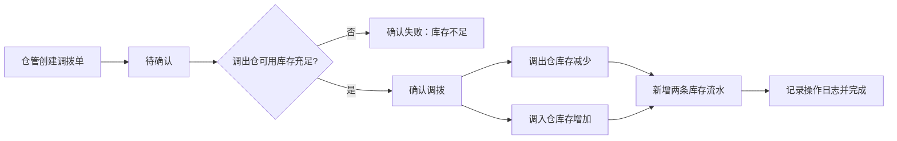

# NOVA ERP V3 产品需求文档：多人协作与库存闭环

| 项目 | 内容 |
| --- | --- |
| 文档版本 | V3.0（评审稿） |
| 文档状态 | 待评审；确认后作为 V3 开发基线 |
| 版本定位 | 从“单机可持久化演示系统”升级为“可多人分工协作、库存可追溯的进销存系统” |
| 适用系统 | NOVA ERP 进销存管理系统 |
| 技术约束 | Vue 3 + Spring Boot 3.4 + JDK 17 + MySQL 8 |

## 1. 背景与现状

当前系统已具备商品档案、采购、销售（含销售退货）、仓库、业务报表、系统设置和经营概览页面；采购入库、销售出库、退货能够带动库存变化，并已接入 MySQL 保存业务状态。

但目前的业务运行数据仍以“应用状态快照”方式保存和恢复，采购单、销售单、库存余额、库存流水之间尚未成为可独立查询、可由数据库约束保证的正式业务关系；同时还没有真实登录、后端权限校验、仓库间调拨、库存盘点和完整操作留痕。因此系统适合单人演示，但还不适合多名采购、销售、仓库人员协同使用。

V3 不以增加财务、批次或全系统界面美化为目标，而是先完成多人协作下最关键的**数据可靠、库存闭环、权限边界和追溯能力**。其中，登录页作为身份认证的必要入口，应具备独立、完整且符合 NOVA 品牌的基础视觉；其余页面的布局与视觉统一放在 V4 开展。

## 2. 产品目标

### 2.1 总目标

让采购、销售、仓库和管理员使用不同账号完成真实业务操作；采购、销售、退货、调拨、盘点引起的每一次库存变化均由正式单据、数据库事务和库存流水共同保证，可查询、不可重复执行、可追溯。

### 2.2 V3 成功标准

1. 用户登录后只能访问其角色被授权的菜单、数据和操作按钮；直接调用无权接口同样被拒绝。
2. 商品、仓库、客户、供应商、采购订单、销售订单、库存余额、库存流水等核心对象以独立数据库表保存，不再以整份 JSON 快照作为业务事实来源。
3. 采购入库、销售出库、销售退货、仓库调拨和盘点调整均在一个数据库事务中完成“单据状态、库存余额、库存流水、操作日志”的更新。
4. 同一张已确认单据重复点击、重复请求或网络重试时，库存只变化一次；库存不足时不产生任何部分更新。
5. 每个商品可按仓库查询现存量、可用量和流水；经营概览明确区分全仓总库存与主仓可用库存。
6. 重启前后端后，账号、业务单据、库存和日志均保持不变；可按说明备份并恢复数据库。

## 3. 用户角色与权限边界

| 角色 | 主要权限 | 不可操作范围 |
| --- | --- | --- |
| 系统管理员 | 用户、角色、权限、基础资料、全量查询、备份说明 | 不可绕过库存单据直接改库存 |
| 采购员 | 新建、编辑、提交采购订单；查看供应商、采购单和采购报表 | 审核采购单、确认入库、调拨、盘点、用户管理 |
| 采购主管 | 审核、驳回采购订单；查看采购分析 | 确认入库、调拨、用户管理 |
| 销售员 | 新建、编辑、提交销售订单；登记销售退货申请；查看客户和销售数据 | 审核销售单、确认出库、调拨、盘点、用户管理 |
| 销售主管 | 审核、驳回销售订单和退货申请；查看销售分析 | 确认出库、调拨、用户管理 |
| 仓库管理员 | 确认采购入库、销售出库、销售退货；创建/确认调拨与盘点单；查看库存余额和流水 | 修改价格、审核采购/销售单、管理用户 |
| 经营管理者 | 全部单据、库存、日志、经营报表只读查询 | 新增、审核、出入库、调拨、盘点、系统设置 |

> 前端隐藏入口只是体验优化；后端必须根据当前登录用户再次校验每一项读取和写入权限。

## 4. V3 范围与优先级

### 4.1 Must：本期必须交付

| 编号 | 模块 | 功能 | 说明 |
| --- | --- | --- | --- |
| DAT-31 | 数据库 | 核心业务数据关系化 | 商品、基础资料、单据、明细、库存余额、流水、日志改为独立表；现有 MySQL 数据可迁移并保留 |
| DAT-32 | 数据库 | 数据迁移与约束 | 提供版本化迁移；商品/仓库/客户/供应商编码唯一；库存余额“商品+仓库”唯一 |
| AUTH-31 | 认证 | 登录页、登录、退出、当前用户 | 提供 NOVA ERP 独立登录页；支持账号密码登录、会话/JWT 登录态校验、退出；密码仅存哈希值 |
| AUTH-32 | 权限 | 角色、菜单、接口鉴权 | 角色绑定权限；前端按权限显示，后端拦截无权接口并返回 403 |
| INV-31 | 库存 | 仓库间调拨 | 支持调出仓、调入仓、商品明细、数量、状态和来源；确认后同时扣减调出仓、增加调入仓 |
| INV-32 | 库存 | 库存盘点与调整 | 仓管创建盘点单，填写实盘数量和原因；确认后按差异生成调整流水 |
| INV-33 | 库存 | 事务、幂等与库存校验 | 所有库存确认操作使用数据库事务；重复确认不重复扣/加库存；出库/调出校验可用库存 |
| OPS-31 | 审计 | 关键操作日志 | 记录登录、单据创建/提交/审核/确认、退货、调拨、盘点、主数据启停、权限变更 |
| OPS-32 | 运维 | 数据备份与恢复说明 | 提供 MySQL 导出、恢复、环境变量配置说明；不在代码库保存真实密码 |
| RPT-31 | 报表 | 统一真实数据源 | 经营概览、采购/销售分析、库存余额、预警和流水统一读取关系化业务数据 |

### 4.2 Should：资源允许时交付

| 编号 | 模块 | 功能 | 说明 |
| --- | --- | --- | --- |
| AUTH-33 | 账号安全 | 管理员重置密码、首次登录改密、登录失败限制 | 不记录明文密码；重置和锁定均写操作日志 |
| INV-34 | 库存 | 调拨在途状态 | 调出后进入“在途”，调入仓确认收货后增加可用库存；本期可先采用一次确认直接完成 |
| INV-35 | 库存 | 库存预留 | 已审核销售单可预留库存，减少可用量，避免多个订单超卖 |
| OPS-33 | 查询 | 单据操作历史与来源回跳 | 在单据详情查看创建、审核、确认人/时间，并可从流水跳转来源单据 |
| RPT-32 | 报表 | 调拨与盘点分析 | 按仓库、商品、日期查看调拨量、盘盈盘亏及原因 |

### 4.3 Won't：明确不在 V3 交付

- 界面整体重做、配色统一、响应式重构和视觉美化（归入 V4）。
- 财务凭证、发票、应收应付、成本核算、税务处理。
- 批次、序列号、保质期、货位、PDA 扫码。
- 多组织、多公司、多币种、多语言、复杂审批工作流。
- 云服务器部署、HTTPS、短信/邮件通知、第三方电商/物流/财务软件集成。

## 5. 核心业务规则

### 5.1 数据与库存口径

| 对象 | 关键规则 |
| --- | --- |
| 商品 | 商品主档不直接维护真实库存；商品页面的“总库存”由所有启用仓库的库存余额汇总得到 |
| 库存余额 | 以“商品 + 仓库”为唯一维度，至少保存现存量、可用量、版本号和更新时间 |
| 库存流水 | 仅追加，不允许编辑或删除；记录业务类型、变化数量、仓库、来源单号、操作人和时间 |
| 安全库存 | 由商品维护；经营概览的预警默认判断主仓可用库存是否低于安全库存，同时展示全仓总库存 |
| 历史数据 | 已停用商品、客户、供应商、仓库不得删除；历史单据必须仍能显示当时的名称和编码 |

### 5.2 通用确认规则

1. 采购入库、销售出库、销售退货、调拨确认、盘点确认均只能由对应状态的单据触发。
2. 所有确认接口须携带单据状态/版本校验；同一单据重复请求时返回已处理结果或明确提示，但不得再次改变库存。
3. 销售出库和调拨调出前，必须校验目标商品在调出仓的可用库存；不足时整个操作失败，不新增流水、不改变任何单据状态。
4. 每次库存变化在同一事务内完成：更新单据状态 → 更新库存余额 → 新增库存流水 → 新增操作日志。任一步失败均整体回滚。
5. 已确认的入库、出库、退货、调拨和盘点单不得直接编辑；需要修正时必须通过冲销或新的业务单据处理。

### 5.3 仓库调拨流程

调拨单字段至少包括：调拨单号、调出仓、调入仓、调拨日期、状态、备注、创建人、确认人、明细（商品、数量）。调出仓和调入仓不能相同；调拨数量必须大于 0；单张单据最多 50 行明细。

首期采用“确认即完成”的调拨方式：确认时两仓库存同步变化。若交付 Should 的“在途”功能，再扩展为“发运 → 收货”两步，但不可改变已确认历史单据的库存事实。

### 5.4 盘点与调整流程

1. 仓管按仓库创建盘点单，系统带出账面数量，填写实盘数量和调整原因。
2. 系统计算差异 `实盘数量 - 账面数量`；差异为 0 的明细无需产生库存流水。
3. 确认盘点后，库存余额更新为实盘数量，并为有差异的商品新增“盘盈调整”或“盘亏调整”流水。
4. 盘点确认后不可修改；若盘点时库存已被其他业务变动，提示数据已变化，要求重新加载账面数量后再确认。

## 6. 功能需求

### 6.1 数据关系化与迁移

| 编号 | 需求 | 验收标准 |
| --- | --- | --- |
| DAT-31 | 为主数据、采购订单/明细、销售订单/明细、入库/出库/退货、调拨、盘点、库存余额、库存流水、用户角色、操作日志建立独立表 | 可直接按单号、商品、仓库、日期查询，不依赖整份应用状态 JSON |
| DAT-32 | 使用版本化迁移脚本创建/升级表结构，并为唯一约束和常用查询建立索引 | 空库可初始化；已有 `nova_erp` 数据升级后不丢失；重复执行迁移安全 |
| DAT-33 | 将现有持久化数据迁移到新表并进行对账 | 商品、主数据、单据数量、各仓库存余额与迁移前一致；迁移结果可复核 |
| DAT-34 | 完成迁移后，移除业务运行时对应用状态快照的依赖 | 重启后数据从关系表恢复；快照表不再作为核心读写来源 |

### 6.2 登录与权限

| 编号 | 需求 | 验收标准 |
| --- | --- | --- |
| AUTH-31 | 提供独立登录页、退出入口、当前用户信息和登录态失效处理 | 正确账号可进入经营概览；退出或登录态失效后无法访问受保护业务接口 |
| AUTH-32 | 管理员可维护用户启停、角色分配和权限项 | 停用用户/角色立即无法登录或访问；权限修改有日志 |
| AUTH-33 | 前端菜单、页面操作按钮按权限渲染，后端接口按权限校验 | 销售员不能看到用户管理；即使手动调用用户接口也返回 403 且不改数据 |
| AUTH-34 | 密码只保存哈希，接口不得返回密码或哈希 | 数据库与接口均不存在可直接使用的明文密码 |

#### 登录页界面要求

1. 页面为进入系统时的独立首屏：未登录用户访问任一业务页面时自动跳转至登录页；登录成功后默认进入经营概览。
2. 使用 NOVA ERP 标识、系统名称和简短说明；采用深蓝渐变背景，并配合低对比度的仓库、货物流向或数据网格抽象元素，体现进销存业务而不干扰表单阅读。
3. 登录卡片居中显示，至少包含用户名、密码、登录按钮、密码显示/隐藏、登录中状态和清晰的失败提示；键盘 Enter 可提交。
4. 可记住最近一次用户名或界面偏好，但不得在浏览器或页面上保存、回填或展示明文密码。
5. 正式登录页不得展示默认账号、默认密码或任何可直接登录的凭证。本地开发/演示环境可在 README 中记录演示账号，但不得把凭证放进登录卡片；正式部署必须通过环境变量覆盖初始密码。
6. 此处仅定义登录页必要的品牌和交互体验；全系统色彩、布局、响应式和组件重构仍属于 V4。

### 6.3 调拨与盘点

| 编号 | 需求 | 验收标准 |
| --- | --- | --- |
| INV-31 | 仓库管理新增“调拨单”页，支持创建、查看、取消待确认单、确认调拨 | 调出仓扣减、调入仓增加、两条流水、单据状态和日志在同一事务中一致 |
| INV-32 | 经营概览风险项可跳转至调拨创建页，并预填风险商品和主仓为调入仓 | 黑色签字笔主仓不足时，可选择华东仓为调出仓创建调拨单 |
| INV-33 | 仓库管理新增“盘点单”页，支持按仓库录入实盘数量、原因和确认 | 盘盈/盘亏后库存余额、流水、单据和操作日志一致 |
| INV-34 | 调拨/盘点列表支持按单号、仓库、状态、日期筛选及查看明细 | 筛选结果、详情数据和数据库记录一致 |

### 6.4 追溯、报表与运维

| 编号 | 需求 | 验收标准 |
| --- | --- | --- |
| OPS-31 | 对关键业务操作写入审计日志，包含操作人、时间、模块、动作、业务编号和摘要 | 从任一已确认调拨或盘点单可查到创建与确认人员和时间 |
| OPS-32 | 库存流水可显示来源单据和操作人，并能回跳详情（无法回跳时至少展示单号） | 任一库存变化都能追溯到具体业务单据 |
| RPT-31 | 报表与经营概览从关系化数据库读取，支持显示调拨、盘点后的实时库存 | 调拨后主仓预警和全仓库存正确更新；盘点后库存余额、流水、报表一致 |
| OPS-33 | README 提供不包含真实密码的数据库备份、恢复、启动和故障检查说明 | 新成员按说明可导出、恢复开发库，并正常启动项目 |

## 7. 页面与交互原则

1. V3 新增独立登录页并采用 NOVA 的基础品牌视觉；登录后的业务页面延续当前导航和页面风格，仅在仓库管理中增加“调拨单”“盘点单”等必要入口；整体布局美化留给 V4。
2. 单据列表提供加载、空态、失败提示、常用筛选和分页；所有库存相关操作必须展示明确的成功/失败结果。
3. 调拨确认、盘点确认、采购入库、销售出库等不可逆库存操作必须二次确认，并明确显示影响仓库、商品和数量。
4. 库存不足提示应说明“哪个仓库、哪个商品、可用多少、需要多少”，不能只显示 HTTP 状态码。
5. 商品档案、库存余额和经营概览必须使用一致口径：商品档案展示全仓总库存；概览风险展示主仓可用库存、全仓总库存、安全库存和主仓缺口。

## 8. 非功能需求

| 分类 | V3 要求 |
| --- | --- |
| 数据一致性 | 关键库存写操作必须使用数据库事务、状态机和幂等校验 |
| 并发控制 | 库存余额使用乐观锁或等价机制；并发出库/调拨不能产生负可用库存 |
| 安全 | 数据库密码、登录密钥不写入 Git；密码使用强哈希；接口统一鉴权 |
| 性能 | 列表默认分页 20 条；单号、状态、仓库、商品、日期等常用条件建立索引 |
| 可观测性 | 后端记录请求失败、事务失败和关键业务异常；日志不得输出密码、令牌等敏感信息 |
| 兼容 | 不破坏现有采购、销售、退货、仓储、报表和经营概览的已确认业务数据 |

## 9. 验收场景

### 场景 A：登录与权限

1. 未登录访问业务网址，确认自动进入 NOVA ERP 登录页；页面不展示任何真实或默认账号密码。
2. 使用销售员账号登录，查看菜单并尝试访问系统设置接口。
3. 使用仓库管理员账号登录，尝试审核销售订单。
4. 管理员调整销售员权限后，该用户重新登录。

**通过标准：**登录页具备完整表单、加载态和错误提示，登录成功进入经营概览；菜单、按钮与接口权限一致；无权请求返回 403 且数据不变；授权变更有日志。

### 场景 B：主仓补货调拨

1. 黑色签字笔全仓总库存为 38，其中主仓可用 18、华东仓可用 20，安全库存为 30。
2. 仓管从经营概览风险项进入调拨，创建“华东仓 → 主仓”调拨 12 支并确认。
3. 刷新商品档案、库存余额、经营概览和库存流水。

**通过标准：**总库存仍为 38；主仓变为 30、华东仓变为 8；经营概览不再将该商品列为主仓风险；产生两条调拨流水及完整操作日志。

### 场景 C：库存不足与重复确认

1. 创建一张调拨量大于调出仓可用库存的调拨单并尝试确认。
2. 创建一张有效调拨单，同时连续点击两次确认或模拟重复请求。

**通过标准：**库存不足时单据和库存均不变；有效单据只确认一次，库存只变化一次，流水和日志各只产生一次。

### 场景 D：盘点调整

1. 仓管对主仓某商品创建盘点单，账面数量为 30，实盘数量为 27，原因填写“盘点差异”。
2. 确认盘点后查询库存余额、流水、经营概览和操作日志。

**通过标准：**主仓库存变为 27，新增数量为 -3 的盘亏流水；该商品按安全库存规则更新预警；可查到盘点原因、操作人和来源单号。

### 场景 E：重启与备份恢复

1. 完成采购入库、销售出库、退货、调拨和盘点各一笔。
2. 重启前后端，检查相关单据、库存余额、流水、报表和日志。
3. 按 README 导出数据库，在测试库恢复后启动系统。

**通过标准：**重启前后数据完全一致；恢复后的测试库可查询到相同业务数据；真实密码未出现在代码或文档中。

## 10. 后续版本边界

V3 完成的标志是：系统可由多人按角色共同操作，库存变化全部由数据库中的正式单据驱动，并能经由单据、流水和日志追溯。

V4 将以界面布局、统一视觉、响应式适配和交互细节优化为重点，不与本期数据模型和权限改造混合实施。财务分析、公开部署、外部系统集成等功能留待 V5、V6 再评估。
