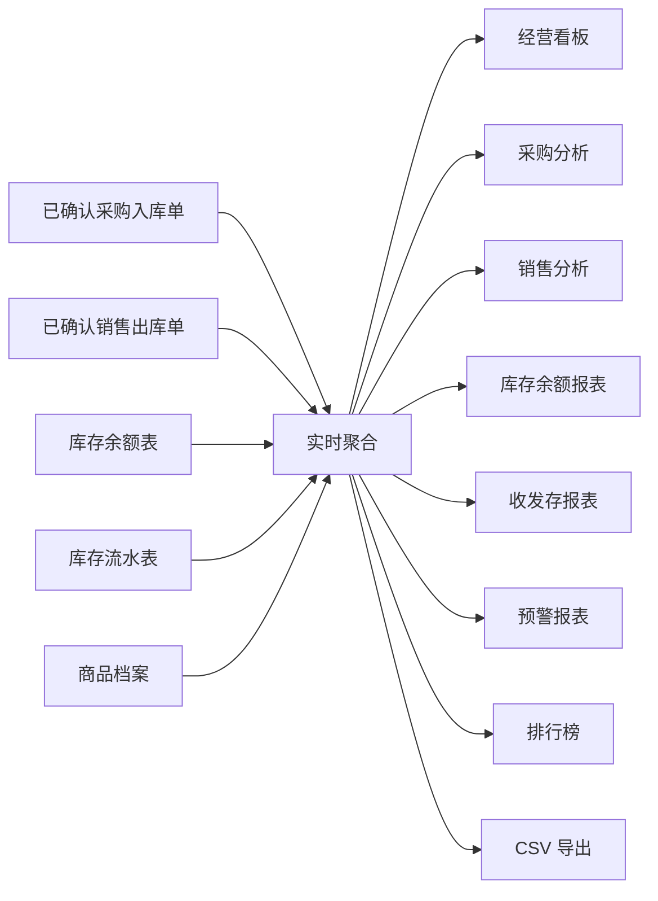

---
AIGC:
    Label: "1"
    ContentProducer: 001191440300708461136T1XGW3
    ProduceID: da10aad093c7eab6be0bf000f3957a90_487c29c4a80f11f18567525400aeaaa3
    ReservedCode1: J6nm/Ut5IsljX69QZQoDha6zzMsQ9BWciTp/UjW+wjFAiW7OlsrA22W1xUDkVsMIQzjD3gvhgg5m3HqNOlq7M5t5E548H47TPpSaxwbus+RX+06i9mz0B2eIyX5QLJ8ZaAXsRt9TvV0zRqWzShMLFjAOsnfaPKu0UMNLPoRZBBFT+vbQMIjL01eYBMY=
    ContentPropagator: 001191440300708461136T1XGW3
    PropagateID: da10aad093c7eab6be0bf000f3957a90_487c29c4a80f11f18567525400aeaaa3
    ReservedCode2: J6nm/Ut5IsljX69QZQoDha6zzMsQ9BWciTp/UjW+wjFAiW7OlsrA22W1xUDkVsMIQzjD3gvhgg5m3HqNOlq7M5t5E548H47TPpSaxwbus+RX+06i9mz0B2eIyX5QLJ8ZaAXsRt9TvV0zRqWzShMLFjAOsnfaPKu0UMNLPoRZBBFT+vbQMIjL01eYBMY=
---

# 业务报表开发文档

| 项目 | 内容 |
| --- | --- |
| 文档版本 | V0.1（开发设计稿） |
| 对应需求 | [PRD.md](PRD.md) 的 RPT-01 ～ RPT-07 |
| 所属版本 | ERP V1 |
| 前置模块 | 商品档案、采购管理、销售管理、仓库管理、用户与角色、MySQL 持久化 |
| 不包含 | 财务核算与成本分摊、离线数仓/ETL、移动端报表推送、自定义报表配置（均留待 V2） |

> 本文按《开发文档模板.md》的骨架（业务背景 / 功能梳理 / 数据库设计 / 业务逻辑 / 相关接口）填充，作为业务报表模块的实现基线模板。若与 PRD 的业务规则冲突，以 PRD 为准；统计口径、表名或接口变更时须同时更新 PRD 和本文。

# 业务背景

采购、销售和仓库模块会产生订单、单据、库存余额与库存流水，但这些数据分散在各业务页面，经营管理者无法在不进入单据详情的情况下快速回答以下问题：

- 本月采购了多少、销售了多少、库存是增是减？
- 哪些商品低库存、缺货，需要补货或停售？
- 资金与货物流向哪个供应商、哪个客户、哪个商品最集中？
- 指定时间段内库存"期初 → 入库 → 出库 → 调整 → 期末"的完整变动链路？

业务报表将这些数据汇总为可读的经营看板与分析视图，支撑日常经营决策和期末复盘。

业务报表模块的核心目标：

1. 建立统一的统计口径：金额、数量、时间范围、计入单据的规则全项目一致。
2. 以实时查询聚合为主，V1 不建离线数仓，保证报表数据与业务单据一致。
3. 每张报表均支持按当前筛选条件导出 CSV，供线下分发与存档。
4. 让经营管理者只读查看全局数据，普通业务角色仅能查看授权范围内的报表。

## 角色与职责

| 角色 | 可执行动作 | 不可执行动作 |
| --- | --- | --- |
| 系统管理员 | 查看全部报表与导出 | 修改业务单据、直接改库存（报表为只读） |
| 采购员 / 采购主管 | 查看采购分析、采购相关报表 | 查看销售与经营全局数据（视授权而定） |
| 销售员 / 销售主管 | 查看销售分析、销售相关报表 | 查看采购数据（视授权而定） |
| 仓库管理员 | 查看库存余额、库存流水、收发存、预警报表 | 查看采购/销售金额类报表 |
| 经营管理者 | 查看全部报表、看板与排行 | 创建、审核、出入库、系统设置 |

> 前端菜单隐藏不等于权限控制，报表接口必须再次校验角色与数据范围。V1 可先用预置账号演示角色。

## 范围说明

### 本次开发范围

- 经营看板：本月采购金额、销售金额、入库数量、出库数量、低库存商品数、近 7 日趋势。
- 采购分析：按日期、供应商、商品、分类统计采购数量、金额、已入库数量。
- 销售分析：按日期、客户、商品、分类统计销售数量、金额、已出库数量。
- 库存余额报表：按仓库、商品、分类展示现存、可用、安全库存、预警状态、参考货值。
- 库存收发存报表：指定日期范围内展示期初、入库、出库、调整、期末数量。
- 预警报表：低库存、缺货、停用但有库存的商品。
- 排行榜：销售金额/数量 Top 10，采购金额 Top 10。
- 全部报表按当前筛选条件导出 UTF-8 CSV。

### 明确不做

- 财务凭证、收入成本毛利、应付应收、发票与税务维度报表。
- 离线数仓、ETL、定时建宽表、OLAP 引擎。
- 自定义报表、用户自建指标、报表订阅与移动端推送。
- 跨组织、多币种、多语言报表。

# 功能梳理

## 1. 功能清单

| 编号 | 功能 | 使用角色 | 说明 | 优先级 |
| --- | --- | --- | --- | --- |
| RPT-01 | 经营看板 | 经营管理者、系统管理员 | 采购/销售金额、入库/出库数量、低库存数、近 7 日趋势 | Must |
| RPT-02 | 采购分析 | 采购员、采购主管、经营管理者 | 按日期、供应商、商品、分类汇总采购数量、金额、已入库数量 | Must |
| RPT-03 | 销售分析 | 销售员、销售主管、经营管理者 | 按日期、客户、商品、分类汇总销售数量、金额、已出库数量 | Must |
| RPT-04 | 库存余额报表 | 仓库管理员、经营管理者 | 现存、可用、安全库存、预警状态、参考货值 | Must |
| RPT-05 | 库存收发存报表 | 仓库管理员、经营管理者 | 期初、入库、出库、调整、期末数量 | Should |
| RPT-06 | 预警报表 | 仓库管理员、采购员、经营管理者 | 低库存、缺货、停用但有库存的商品 | Should |
| RPT-07 | 排行榜 | 经营管理者、系统管理员 | 销售/采购金额与数量 Top 10 | Should |

## 2. 页面与交互

所有报表页面遵循统一布局：**查询区 + 指标/汇总区（可选） + 明细列表区 + 导出区**。

### 2.1 经营看板

**入口**：首页 / 经营看板。

| 区域 | 内容 | 规则 |
| --- | --- | --- |
| 查询区 | 日期范围（默认本月） | 可选自定义范围，最长 366 天 |
| 指标区 | 采购金额、销售金额、入库数量、出库数量、低库存商品数 | 与所选日期范围一致；金额保留两位小数 |
| 趋势区 | 近 7 日采购/销售金额趋势图 | 按日聚合，缺数据日期计 0 |
| 列表区 | 低库存商品 Top、近期单据摘要（可选） | 便于跳转到对应业务页面 |

### 2.2 采购分析 / 销售分析

**入口**：业务报表 → 采购分析 / 销售分析。

两张页面结构一致，维度不同：

| 维度 | 采购分析（RPT-02） | 销售分析（RPT-03） |
| --- | --- | --- |
| 时间维度 | 日期 | 日期 |
| 主体维度 | 供应商 | 客户 |
| 商品维度 | 商品、分类 | 商品、分类 |
| 指标 | 采购数量、采购金额、已入库数量 | 销售数量、销售金额、已出库数量 |

页面默认按"日期"维度展示汇总行，可通过维度切换查看按供应商/客户/商品/分类的明细分组；点击分组行可下钻到对应单据列表。

### 2.3 库存余额报表

**入口**：业务报表 → 库存报表。

| 字段/操作 | 规则 |
| --- | --- |
| 筛选 | 仓库、商品、分类、库存状态（正常/低库存/无库存） |
| 列表 | 仓库、商品编码、商品名称、分类、现存、锁定、可用、安全库存、预警状态、参考货值 |
| 参考货值 | `商品参考单价 × 现存数量`，页面须标注"非财务成本" |

### 2.4 库存收发存报表

**入口**：业务报表 → 收发存报表。

| 字段 | 规则 |
| --- | --- |
| 期初数量 | 所选日期范围开始时刻的现存数量 |
| 入库数量 | 范围内已确认入库合计（采购入库、调整盘盈等） |
| 出库数量 | 范围内已确认出库合计（销售出库、调整盘亏等） |
| 调整数量 | 盘点/调拨引起的净调整 |
| 期末数量 | 所选日期范围结束时刻的现存数量（= 期初 + 入库 − 出库 + 调整） |

### 2.5 预警报表

**入口**：业务报表 → 预警报表。

| 预警类型 | 判定规则 | 处置建议 |
| --- | --- | --- |
| 低库存 | 可用数量之和 < 安全库存 | 创建采购订单补货 |
| 缺货 | 可用数量之和 = 0 且有销售需求 | 优先补货或确认是否停售 |
| 停用但有库存 | 商品状态为停用但现存数量 > 0 | 确认是否清库存或恢复启用 |

### 2.6 排行榜

**入口**：业务报表 → 排行榜。

排行类型：销售金额 Top 10、销售数量 Top 10、采购金额 Top 10。支持按日期范围筛选，并列展示排序名次、主体名称、数量、金额与占比。

### 2.7 CSV 导出（公共）

| 规则 | 说明 |
| --- | --- |
| 导出范围 | 每张报表均可导出，导出列为当前页面列表列，行数为当前筛选结果 |
| 编码 | UTF-8（带 BOM，避免 Excel 中文乱码） |
| 文件命名 | `报表名_YYYYMMDD_HHmmss.csv` |
| 金额字段 | 保留两位小数；数量保留业务单位精度 |

# 数据库设计

## 1. 设计约定

1. 业务报表**不做业务数据写入**，全部基于既有业务表实时聚合，不新增写库表。
2. 报表依赖的商品、供应商、客户、仓库、单据、库存余额、库存流水等表结构由对应模块定义，本模块负责引用与联查。
3. 统计口径以"已确认/已完成"的出入库单与库存流水为准（见 PRD 报表通用规则），草稿、待审核、已驳回单据一律不计入。
4. 金额使用 `DECIMAL(18,2)`，数量使用 `DECIMAL(18,4)`；严禁使用 `float`、`double` 做聚合计算。
5. 若后续数据量增大导致实时聚合过慢，再引入"每日统计快照表"（见下，标记为可选），V1 不强制建立。

## 2. 报表数据依赖（不新增表）

| 来源表 | 所属模块 | 报表用途 |
| --- | --- | --- |
| `md_product` | 商品档案 | 商品名称、分类、单位、参考单价、安全库存、启用状态 |
| `sys_supplier` | 系统设置 | 采购金额按供应商分组 |
| `sys_customer` | 系统设置 | 销售金额按客户分组 |
| `sys_warehouse` | 系统设置 | 库存按仓库维度展示 |
| `pur_purchase_order` / `_item` | 采购管理 | 采购订单表头与明细快照 |
| `wh_stock_in_order` / `_item` | 采购管理 | 采购入库单与明细（采购金额、入库数量来源） |
| `sal_sales_order` / `_item` | 销售管理 | 销售订单表头与明细快照 |
| `wh_stock_out_order` / `_item` | 销售管理 | 销售出库单与明细（销售金额、出库数量来源） |
| `wh_inventory_balance` | 仓库管理 | 现存、锁定、可用数量 |
| `wh_inventory_transaction` | 仓库管理 | 收发存、时间维度聚合的流水依据 |

## 3. 可选：每日统计快照表（V1 后性能优化用，非本期必建）

表名：`rpt_daily_snapshot`

| 字段名 | 数据类型 | 约束 | 注释 | 备注 |
| ------ | -------- | ---- | ---- | ---- |
| id | BIGINT UNSIGNED | PK，NOT NULL | 主键 | |
| snapshot_date | DATE | NOT NULL | 统计日期 | `UNIQUE(snapshot_date, metric_code, dimension_key)` |
| metric_code | VARCHAR(32) | NOT NULL | 指标编码 | 如 `PURCHASE_AMOUNT`、`SALE_AMOUNT` |
| dimension_key | VARCHAR(64) | NOT NULL | 维度键 | 如日期/供应商ID/商品ID |
| dimension_name | VARCHAR(120) | NOT NULL | 维度名称快照 | |
| metric_value | DECIMAL(18,2) | NOT NULL | 指标值 | 金额或数量按精度约定 |
| created_at | DATETIME | NOT NULL | 生成时间 | |

> 用途：当日收入数据汇总后按日归档，历史报表直接读快照，避免长周期实时扫描单据明细。由定时任务生成，生成后同一天内不重复写库。

# 业务逻辑

## 1. 通用统计口径（所有报表统一遵守）

1. 默认统计范围当前自然月；支持自定义日期范围，最长 366 天。
2. 计入单据：
   - 采购侧：已确认（`CONFIRMED`）的采购入库单及其明细；
   - 销售侧：已确认（`CONFIRMED`）的销售出库单及其明细；
   - 草稿、待审核、已驳回、作废单据不计入任何报表。
3. 金额人民币、两位小数；数量保留业务单位精度（`DECIMAL(18,4)`）。
4. 时间归属取单据"确认时间/业务发生时间"，而非创建时间。
5. 页面展示数据刷新时间与统计口径，避免将参考货值误解为财务成本。
6. 所有聚合查询必须带时间范围上界；`dateFrom` 不能晚于 `dateTo`，范围不超过 366 天，否则返回参数错误（`REPORT_DATE_RANGE_INVALID`）。

## 2. 经营看板（RPT-01）

1. 一次查询返回：采购金额、销售金额、入库数量、出库数量、低库存商品数。
2. 采购金额 = 所选范围内已确认采购入库单明细 `received_quantity × unit_price` 之和；
   销售金额 = 所选范围内已确认销售出库单明细 `out_quantity × unit_price` 之和。
3. 入库数量 = 已确认采购入库明细数量之和；出库数量 = 已确认销售出库明细数量之和。
4. 低库存商品数 = `可用数量之和 < 安全库存` 且已启用的商品数量。
5. 近 7 日趋势：对 7 个自然日按日汇总采购金额与销售金额，缺失日期补 0。

## 3. 采购分析（RPT-02）

1. 可选维度：日期、供应商、商品、分类。默认按日期分组。
2. 指标：采购数量、采购金额、已入库数量 = 已确认采购入库明细按维度归集。
3. 供应商停用后历史数据仍参与统计（使用单据快照名称）。
4. 金额小计/总计在服务端计算并随列表返回，前端不做二次汇总。

## 4. 销售分析（RPT-03）

1. 可选维度：日期、客户、商品、分类。默认按日期分组。
2. 指标：销售数量、销售金额、已出库数量 = 已确认销售出库明细按维度归集。
3. 同一销售订单分批出库时，各批次均在出库确认时点计入。

## 5. 库存余额报表（RPT-04）

1. 直接读取 `wh_inventory_balance`，关联商品档案取安全库存、参考单价。
2. 预警状态计算：`available < safetyStock` 为低库存；`available = 0` 为无库存；否则正常。
3. 参考货值 = `product.referencePrice × onHandQuantity`，接口响应标注 `reference-only: true`。

## 6. 库存收发存报表（RPT-05）

1. 期初 = 范围开始时刻前的最后一笔库存流水后的余额（若全周期无流水则为当前余额反推）；
   实现简化方案：`期初 = 期末 − (范围内入库 − 范围内出库 + 范围内调整)`，期末取当前余额。
2. 入库/出库/调整 = 范围内 `wh_inventory_transaction` 按 `transaction_type` 分组汇总 `change_quantity`（入库为正、出库为负、调整 ±）。
3. 校验 `期初 + 入库 + 调整 − 出库 = 期末`，若不等应在明细中暴露异常行，不得静默修正。

## 7. 预警报表（RPT-06）

1. 低库存：可用数量之和 < 安全库存，按缺口（`安全库存 − 可用`）降序。
2. 缺货：可用数量之和 = 0。
3. 停用但有库存：商品停用且现存 > 0。
4. 每种预警给出商品、分类、可用数量、安全库存、涉及仓库，供一键跳转创建采购订单。

## 8. 排行榜（RPT-07）

1. 类型：`SALE_AMOUNT`、`SALE_QUANTITY`、`PURCHASE_AMOUNT`，默认返回 Top 10。
2. 排序字段与类型强绑定；同值并列，名次可并列。
3. 返回每项占比 = 该项金额/总量（保留两位小数，分母为 0 时占比 0）。

## 9. CSV 导出

1. 复用各报表的聚合查询，追加导出列映射，不允许前端拼 CSV 代替后端。
2. 统一导出接口接收 `reportType` + 原报表全部筛选项，返回 `text/csv; charset=utf-8`。
3. 导出前同样执行权限与日期范围校验；导出行数与当前筛选结果一致。

## 10. 异常处理与提示

| 场景 | 错误码建议 | 用户提示 |
| --- | --- | --- |
| 日期范围超过 366 天 | `REPORT_DATE_RANGE_INVALID` | 日期范围最长不能超过 366 天 |
| 开始日期晚于结束日期 | `REPORT_DATE_RANGE_INVALID` | 开始日期不能晚于结束日期 |
| 未知报表类型 | `REPORT_TYPE_NOT_FOUND` | 不支持的报表类型，请联系管理员 |
| 无报表访问权限 | `REPORT_ACCESS_FORBIDDEN` | 你没有查看该报表的权限 |
| 维度参数非法 | `REPORT_DIMENSION_INVALID` | 维度参数不合法，请刷新后重试 |

# 相关接口

## 1. 接口通用约定

1. 基础路径为 `/api`，使用 JSON，时间格式采用 ISO 8601，日期参数使用 `yyyy-MM-dd`。
2. 需要登录的接口通过 `Authorization: Bearer <token>` 传递令牌；接口权限校验不可省略。
3. 成功响应统一为：`{ "code": "OK", "message": "success", "data": ... }`。
4. 失败响应统一为：`{ "code": "错误码", "message": "用户可读错误", "fieldErrors": [...] }`。
5. 报表请求公共参数：`dateFrom`、`dateTo`（`yyyy-MM-dd`，可选，默认本月），`dateFrom ≤ dateTo` 且范围 ≤ 366 天。

## 2. 经营看板接口

| 对应的功能 | 内容 |
| ---------- | ---- |
| 查询经营看板 | `GET /api/reports/dashboard?dateFrom=&dateTo=` |
| 参数 | 日期范围可选（默认本月）；可选 `warehouseId` 限定仓库 |
| 返回 | `purchaseAmount`、`saleAmount`、`stockInQuantity`、`stockOutQuantity`、`lowStockCount`、`trend7Days[{date, purchaseAmount, saleAmount}]` |

## 3. 采购分析接口

| 对应的功能 | 内容 |
| ---------- | ---- |
| 查询采购分析 | `GET /api/reports/purchase-analysis?dateFrom=&dateTo=&dimension=DATE&supplierId=&productId=&categoryId=&page=1&pageSize=20` |
| 参数 | `dimension` 取值 `DATE` / `SUPPLIER` / `PRODUCT` / `CATEGORY`；其余筛选项可选 |
| 返回 | 分组行 + 汇总：数量、金额、已入库数量；含总计行 |

## 4. 销售分析接口

| 对应的功能 | 内容 |
| ---------- | ---- |
| 查询销售分析 | `GET /api/reports/sales-analysis?dateFrom=&dateTo=&dimension=DATE&customerId=&productId=&categoryId=&page=1&pageSize=20` |
| 参数 | `dimension` 取值 `DATE` / `CUSTOMER` / `PRODUCT` / `CATEGORY`；其余筛选项可选 |
| 返回 | 分组行 + 汇总：数量、金额、已出库数量；含总计行 |

## 5. 库存余额报表接口

| 对应的功能 | 内容 |
| ---------- | ---- |
| 查询库存余额报表 | `GET /api/reports/inventory-balance?warehouseId=&productId=&categoryId=&stockStatus=NORMAL&page=1&pageSize=20` |
| 参数 | `stockStatus` 取值 `NORMAL` / `LOW` / `EMPTY` / `ALL` |
| 返回 | 仓库、商品、现存、锁定、可用、安全库存、预警状态、参考货值（`referenceOnly: true`） |

## 6. 库存收发存报表接口

| 对应的功能 | 内容 |
| ---------- | ---- |
| 查询收发存报表 | `GET /api/reports/inventory-movement?dateFrom=&dateTo=&warehouseId=&productId=&categoryId=` |
| 参数 | 日期范围必填；其余可选 |
| 返回 | 每商品/仓库行：期初、入库、出库、调整、期末数量；校验不平衡时返回异常行标识 |

## 7. 预警报表接口

| 对应的功能 | 内容 |
| ---------- | ---- |
| 查询预警报表 | `GET /api/reports/low-stock?alertType=LOW_STOCK&warehouseId=&productId=&categoryId=&page=1&pageSize=20` |
| 参数 | `alertType` 取值 `LOW_STOCK` / `OUT_OF_STOCK` / `DISABLED_WITH_STOCK` / `ALL` |
| 返回 | 商品、分类、可用数量、安全库存、涉及仓库、缺口数量（缺口为负时按 0 处理） |

## 8. 排行榜接口

| 对应的功能 | 内容 |
| ---------- | ---- |
| 查询排行榜 | `GET /api/reports/rankings?type=SALE_AMOUNT&dateFrom=&dateTo=&limit=10` |
| 参数 | `type` 取值 `SALE_AMOUNT` / `SALE_QUANTITY` / `PURCHASE_AMOUNT`；`limit` 默认 10、最大 50 |
| 返回 | 排名列表：名次、主体名称、数量、金额、占比 |

## 9. 报表导出接口（统一）

| 对应的功能 | 内容 |
| ---------- | ---- |
| 导出报表 CSV | `GET /api/reports/export?reportType=dashboard&dateFrom=&dateTo=&...` |
| 参数 | `reportType` 与对应报表全部筛选项；`reportType` 取舍见错误码表 |
| 返回 | `Content-Type: text/csv; charset=utf-8`，文件名 `报表名_YYYYMMDD_HHmmss.csv` |

## 10. 接口权限矩阵

| 报表 | 系统管理员 | 采购员 | 采购主管 | 销售员 | 销售主管 | 仓库管理员 | 经营管理者 |
| --- | --- | --- | --- | --- | --- | --- | --- |
| 经营看板 | 是 | 否 | 否 | 否 | 否 | 否 | 是 |
| 采购分析 | 是 | 是 | 是 | 否 | 否 | 否 | 是 |
| 销售分析 | 是 | 否 | 否 | 是 | 是 | 否 | 是 |
| 库存余额 / 收发存 / 预警 | 是 | 是（预警） | 是（预警） | 否 | 否 | 是 | 是 |
| 排行榜 | 是 | 否 | 否 | 否 | 否 | 否 | 是 |
| 导出 | 跟随对应报表权限 | 跟随对应报表权限 | 跟随对应报表权限 | 跟随对应报表权限 | 跟随对应报表权限 | 跟随对应报表权限 | 跟随对应报表权限 |

# 开发与测试检查清单

## 后端

- [ ] 建立统一的报表查询服务与公共参数校验（日期范围 ≤ 366 天、时间顺序）。
- [ ] 建立明确的数据来源：采购/销售金额取自已确认出入库单明细，不外溢未确认单据。
- [ ] 聚合计算统一使用 `BigDecimal`，金额两位小数、数量按业务精度。
- [ ] 每张报表独立 Service 方法，禁止前端拼接统计结果。
- [ ] 报表接口全部做角色与数据范围权限校验。
- [ ] 导出统一走 `/api/reports/export`，UTF-8 带 BOM，列与页面一致。
- [ ] 页面返回数据附带 `dataRefreshedAt` 与统计口径说明字段。

## 前端

- [ ] 增加经营看板、采购分析、销售分析、库存余额、收发存、预警、排行榜页面与路由。
- [ ] 统一报表页面骨架组件：查询区、汇总区、列表区、导出按钮。
- [ ] 根据当前用户角色隐藏无权限报表菜单与导出按钮。
- [ ] 图表（近 7 日趋势、排行榜）使用现有前端技术栈，不引入额外重型依赖（结合团队约定）。
- [ ] 所有报表提供导出动作，导出后提示下载完成。

## 验收测试

| 编号 | 测试场景 | 预期结果 |
| --- | --- | --- |
| RPT-TC-01 | 新完成一笔采购入库后刷新采购分析与经营看板 | 采购金额、入库数量即时体现，库存余额一致 |
| RPT-TC-02 | 新完成一笔销售出库后刷新销售分析与经营看板 | 销售金额、出库数量、库存余额互相一致 |
| RPT-TC-03 | 草稿/待审核采购单参与报表统计 | 不计入任何报表指标 |
| RPT-TC-04 | 选择超过 366 天的日期范围 | 接口拒绝，提示范围超限 |
| RPT-TC-05 | 收发存报表期初+入库−出库+调整 | 等于期末数量，不平衡行被标记 |
| RPT-TC-06 | 出库后可用库存低于安全库存 | 库存余额报表、预警报表均显示低库存 |
| RPT-TC-07 | 按当前筛选条件导出 CSV | 文件行数与页面列表一致，Excel 打开无乱码 |
| RPT-TC-08 | 采购员访问销售分析接口 | 返回无权限错误，页面无入口 |
| RPT-TC-09 | 经营管理者查看全部报表 | 均为只读，无创建/审核/出入库操作入口 |
| RPT-TC-10 | 重启后端后刷新报表 | 数据一致，聚合口径无变化 |
*（内容由AI生成，仅供参考）*
