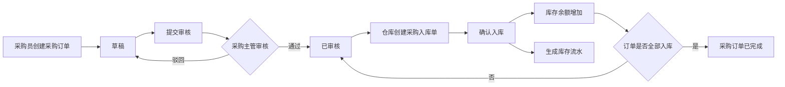
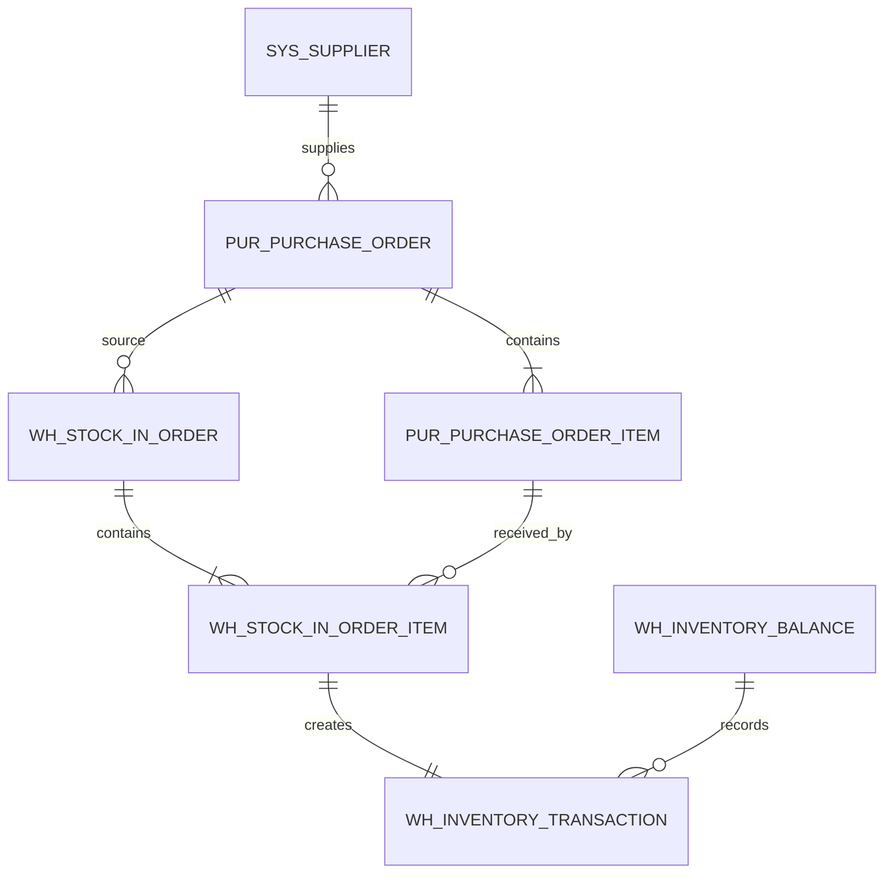

# 采购管理开发文档

| 项目 | 内容 |
| --- | --- |
| 文档版本 | V0.1（开发设计稿） |
| 对应需求 | [PRD.md](PRD.md) 的 PUR-01 ～ PUR-07 |
| 所属版本 | ERP V1 |
| 前置模块 | 商品档案、仓库主数据、用户与角色、MySQL 持久化 |
| 不包含 | 采购退货、应付结算、发票、复杂审批流（均留待 V2） |

> 本文中的状态码、表名和接口为采购模块的实现基线。若与 PRD 的业务规则冲突，以 PRD 为准；字段、接口或流程变更时须同时更新 PRD 和本文。

# 业务背景

当前 ERP 已有商品档案和“快速补货”演示能力，但补货会直接修改商品库存，无法回答“是谁采购、向谁采购、何时到货、入了哪个仓、库存为什么增加”等真实业务问题。

采购管理用于将缺货预警或人工采购需求转化为正式单据，并由仓库基于审核通过的采购订单完成实际入库。采购订单、入库单、库存余额和库存流水组成可追溯闭环：



采购模块的核心目标：

1. 管理可用的供应商资料，避免采购单使用自由文本供应商。
2. 让采购订单具备草稿、提交、审核、驳回、完成等明确状态。
3. 支持一张采购订单多次到货、分批入库。
4. 只在“确认入库”时增加库存，并生成不可篡改的库存流水。
5. 让采购、仓库、管理者可以按权限查询订单、到货差异和采购数据。

## 角色与职责

| 角色 | 可执行动作 | 不可执行动作 |
| --- | --- | --- |
| 系统管理员 | 管理供应商、查看采购数据 | 审核采购单、确认入库（除非同时拥有对应角色） |
| 采购员 | 创建、编辑草稿/驳回采购单，提交采购单，查询自己的采购单 | 审核采购单、确认入库 |
| 采购主管 | 查询采购单，审核通过或驳回 | 修改他人已提交单据、确认入库 |
| 仓库管理员 | 查询已审核采购单，创建并确认采购入库单，查看库存流水 | 修改采购价格、审核采购单 |
| 经营管理者 | 只读查询采购单、入库记录和采购报表 | 创建、审核、入库 |

## 范围说明

### 本次开发范围

- 供应商查询、维护、启停。
- 采购订单的创建、编辑、删除、提交、审核、驳回、作废、查询。
- 基于采购订单的采购入库、分批入库、到货差异展示。
- 确认入库时更新库存余额、写入库存流水、更新订单已入库数量和完成状态。
- 采购订单及采购入库单的列表、详情、基础筛选与 CSV 导出接口预留。

### 明确不做

- 采购申请、询价、比价、供应商准入评分。
- 采购退货、红字单、应付账款、付款、发票。
- 多级审批、会签、审批流配置、消息提醒。
- 取消已确认入库后自动反冲库存；后续必须通过采购退货实现。

# 功能梳理

## 1. 功能清单

| 编号 | 功能 | 使用角色 | 说明 | 优先级 |
| --- | --- | --- | --- | --- |
| PUR-01 | 供应商管理 | 系统管理员 | 供应商的查询、新增、编辑、启停 | Must |
| PUR-02 | 采购订单列表 | 采购员、采购主管、经营管理者 | 按单号、供应商、日期、状态筛选并查看订单进度 | Must |
| PUR-03 | 新建/编辑采购订单 | 采购员 | 选择供应商与商品，维护数量、采购单价、预计到货日、备注 | Must |
| PUR-04 | 提交、审核、驳回、作废 | 采购员、采购主管 | 管控订单状态，保留审核意见与操作人 | Must |
| PUR-05 | 采购入库 | 仓库管理员 | 从已审核订单创建入库单，并支持多次到货 | Must |
| PUR-06 | 到货差异 | 采购员、采购主管、仓库管理员 | 订单明细展示订购、累计入库、未入库数量 | Should |
| PUR-07 | 采购数据导出 | 采购员、采购主管、经营管理者 | 按当前筛选条件导出订单/入库记录 CSV | Should |

## 2. 页面与交互

### 2.1 供应商列表

**入口**：系统设置 → 供应商管理。

| 区域 | 字段/操作 | 规则 |
| --- | --- | --- |
| 查询区 | 供应商编码、供应商名称、状态 | 支持模糊查询；状态为全部/启用/停用 |
| 列表区 | 编码、名称、联系人、电话、地址、状态、更新人、更新时间 | 默认按更新时间倒序 |
| 新增/编辑弹窗 | 编码、名称、联系人、联系电话、地址、备注、状态 | 编码、名称必填；编码全局唯一 |
| 操作区 | 编辑、启用/停用 | 已被采购订单引用的供应商只能停用，不能物理删除 |

### 2.2 采购订单列表

**入口**：采购管理 → 采购订单。

| 区域 | 字段/操作 | 规则 |
| --- | --- | --- |
| 查询区 | 单号、供应商、订单日期范围、状态、创建人 | 默认显示最近 30 天；日期范围最长 366 天 |
| 指标区 | 订单数、待审核数、待入库订单数、采购总金额 | 仅统计当前筛选范围；金额保留两位小数 |
| 列表区 | 单号、供应商、订单日期、状态、明细数量、订单金额、已入库进度、创建人、操作 | 默认按创建时间倒序 |
| 操作区 | 查看、编辑、提交、审核、驳回、作废、创建入库单 | 按订单状态与用户权限展示操作按钮 |

订单状态展示：

| 状态码 | 页面名称 | 含义 | 可操作人 |
| --- | --- | --- | --- |
| `DRAFT` | 草稿 | 未提交，可继续编辑 | 创建人 |
| `PENDING_APPROVAL` | 待审核 | 已提交，等待采购主管处理 | 采购主管 |
| `APPROVED` | 已审核 | 审核通过，可创建采购入库单 | 仓库管理员 |
| `REJECTED` | 已驳回 | 审核不通过，可修改后再次提交 | 创建人 |
| `COMPLETED` | 已完成 | 全部订单明细已完成入库 | 只读 |
| `VOIDED` | 已作废 | 不再执行，不可恢复 | 只读 |

### 2.3 新建/编辑采购订单

**入口**：采购订单列表 → 新建采购订单；草稿/驳回订单 → 编辑。

| 字段 | 必填 | 来源/输入方式 | 校验规则 |
| --- | --- | --- | --- |
| 采购单号 | 是 | 后端保存草稿时生成 | 系统生成，前端只读，唯一 |
| 供应商 | 是 | 选择启用供应商 | 必须存在且状态为启用 |
| 订单日期 | 是 | 默认当天，可选择 | 不晚于当前日期（是否允许未来日期由业务确认） |
| 预计到货日期 | 否 | 日期选择 | 不早于订单日期 |
| 备注 | 否 | 文本输入 | 最长 500 字符 |
| 商品 | 是 | 从启用商品档案选择 | 同一订单内商品不可重复 |
| 采购数量 | 是 | 数字输入 | 大于 0，最多 4 位小数 |
| 含税单价 | 是 | 数字输入 | 不小于 0，保留 2 位小数 |
| 行金额 | 是 | 系统计算 | `采购数量 × 含税单价`，保留 2 位小数 |
| 订单金额 | 是 | 系统汇总 | 所有行金额之和，前端展示、后端重新计算 |

交互规则：

1. 新增一行时只可选择“启用”的商品与供应商。
2. 商品一经选中，自动带出商品编码、单位与当前参考销售价（仅供参考，不作为采购价）。
3. 前端可以实时计算金额；提交/保存时后端必须重新计算，不能相信前端传入金额。
4. 草稿和已驳回订单可以保存、删除、修改或提交；待审核及之后的订单只读。
5. 订单明细至少一行，删除最后一行时不允许保存或提交。

### 2.4 提交、审核、驳回与作废

| 动作 | 前置状态 | 操作角色 | 结果状态 | 规则 |
| --- | --- | --- | --- | --- |
| 提交 | 草稿、已驳回 | 创建人 | 待审核 | 校验供应商、商品、数量、单价、日期均有效 |
| 审核通过 | 待审核 | 采购主管 | 已审核 | 记录审核人、审核时间、审核意见（可空） |
| 驳回 | 待审核 | 采购主管 | 已驳回 | 审核意见必填，订单可由创建人修改后重提 |
| 作废 | 草稿、已驳回、待审核、已审核且未入库 | 创建人或采购主管 | 已作废 | 已发生部分/全部入库的订单不可作废 |

操作时必须弹出二次确认框。审核、驳回、作废需写入操作日志。

### 2.5 采购入库

**入口**：采购管理 → 采购入库；或采购订单详情 → 创建入库单。

| 字段 | 必填 | 说明 | 校验规则 |
| --- | --- | --- | --- |
| 入库单号 | 是 | 系统生成，例如 `IN20260903-0001` | 唯一、只读 |
| 来源采购单 | 是 | 从已审核且未完成订单选择 | 只能选择状态为 `APPROVED` 的订单 |
| 入库仓库 | 是 | 选择启用仓库 | 必须存在且状态为启用 |
| 入库日期 | 是 | 默认当天 | 不晚于当前日期（是否允许补录由业务确认） |
| 明细商品 | 是 | 由来源采购单带出 | 不可新增非来源订单商品 |
| 本次实收数量 | 是 | 仓库人员填写 | 大于 0；不得超过该行未入库数量 |
| 未入库数量 | 是 | 系统计算 | `订单数量 - 累计已入库数量`，只读 |
| 备注 | 否 | 文本输入 | 最长 500 字符 |

入库单状态：`DRAFT`（草稿）、`CONFIRMED`（已确认）、`VOIDED`（已作废，仅草稿可作废）。确认后的入库单不可编辑或删除。

### 2.6 到货差异展示

在采购订单详情与采购入库页面展示每个订单明细的：订购数量、累计已入库数量、未入库数量、最后入库时间。

当某行尚未全部入库时，订单整体保持 `APPROVED`；所有行的未入库数量均为 0 时，订单自动变为 `COMPLETED`。V1 不要求填写差异原因，但应通过未入库数量明确暴露到货差异。

# 数据库设计

## 1. 设计约定

1. 数据库使用 MySQL 8，字符集统一为 `utf8mb4`，排序规则使用 `utf8mb4_0900_ai_ci`。
2. 主键使用 `BIGINT UNSIGNED`，由后端雪花 ID 或数据库自增策略统一生成；本项目实现阶段二选一，不得混用。
3. 金额使用 `DECIMAL(18,2)`，数量使用 `DECIMAL(18,4)`；严禁使用 `float`、`double` 保存金额。
4. 所有业务表保留 `created_at`、`created_by`、`updated_at`、`updated_by`；关键单据额外保留审核与确认字段。
5. “删除”默认采用逻辑删除（`deleted = 1`）；被订单、入库单或流水引用的数据不可物理删除。
6. 下列 `product_id`、`warehouse_id`、`user_id` 等外键指向后续基础资料表；是否真正建立数据库外键由团队统一决定，但应用层必须校验引用完整性。

## 2. 表关系



## 3. 供应商表

表名：`sys_supplier`

| 字段名 | 数据类型 | 约束 | 注释 | 备注 |
| ------ | -------- | ---- | ---- | ---- |
| id | BIGINT UNSIGNED | PK，NOT NULL | 主键 | 统一 ID 策略 |
| supplier_code | VARCHAR(32) | NOT NULL，UNIQUE | 供应商编码 | 例如 `SUP-0001` |
| supplier_name | VARCHAR(120) | NOT NULL | 供应商名称 | 建议建立普通索引 |
| contact_name | VARCHAR(64) | NULL | 联系人 |  |
| contact_phone | VARCHAR(32) | NULL | 联系电话 | 不强制手机号格式 |
| address | VARCHAR(255) | NULL | 地址 |  |
| status | VARCHAR(16) | NOT NULL | 状态 | `ENABLED` / `DISABLED` |
| remark | VARCHAR(500) | NULL | 备注 |  |
| deleted | TINYINT(1) | NOT NULL，DEFAULT 0 | 逻辑删除标记 | 0 否，1 是 |
| created_at | DATETIME | NOT NULL | 创建时间 |  |
| created_by | BIGINT UNSIGNED | NOT NULL | 创建人 ID |  |
| updated_at | DATETIME | NOT NULL | 更新时间 |  |
| updated_by | BIGINT UNSIGNED | NOT NULL | 更新人 ID |  |

索引建议：`uk_supplier_code(supplier_code)`、`idx_supplier_name(supplier_name)`、`idx_supplier_status(status, deleted)`。

## 4. 采购订单主表

表名：`pur_purchase_order`

| 字段名 | 数据类型 | 约束 | 注释 | 备注 |
| ------ | -------- | ---- | ---- | ---- |
| id | BIGINT UNSIGNED | PK，NOT NULL | 主键 |  |
| order_no | VARCHAR(32) | NOT NULL，UNIQUE | 采购单号 | 例如 `PO20260903-0001` |
| supplier_id | BIGINT UNSIGNED | NOT NULL | 供应商 ID | 引用 `sys_supplier` |
| supplier_code | VARCHAR(32) | NOT NULL | 供应商编码快照 | 保留历史可读性 |
| supplier_name | VARCHAR(120) | NOT NULL | 供应商名称快照 | 保留历史可读性 |
| order_date | DATE | NOT NULL | 订单日期 |  |
| expected_arrival_date | DATE | NULL | 预计到货日期 | 不早于订单日期 |
| status | VARCHAR(32) | NOT NULL | 订单状态 | 见状态表 |
| total_quantity | DECIMAL(18,4) | NOT NULL | 订单总数量 | 后端汇总 |
| total_amount | DECIMAL(18,2) | NOT NULL | 订单总金额 | 后端汇总 |
| remark | VARCHAR(500) | NULL | 备注 |  |
| submitted_at | DATETIME | NULL | 提交时间 |  |
| submitted_by | BIGINT UNSIGNED | NULL | 提交人 ID |  |
| approved_at | DATETIME | NULL | 审核时间 |  |
| approved_by | BIGINT UNSIGNED | NULL | 审核人 ID |  |
| approval_comment | VARCHAR(500) | NULL | 审核意见 | 驳回时必填 |
| version | INT UNSIGNED | NOT NULL，DEFAULT 0 | 乐观锁版本 | 更新状态时校验 |
| deleted | TINYINT(1) | NOT NULL，DEFAULT 0 | 逻辑删除标记 | 仅草稿可删除 |
| created_at | DATETIME | NOT NULL | 创建时间 |  |
| created_by | BIGINT UNSIGNED | NOT NULL | 创建人 ID |  |
| updated_at | DATETIME | NOT NULL | 更新时间 |  |
| updated_by | BIGINT UNSIGNED | NOT NULL | 更新人 ID |  |

索引建议：`uk_purchase_order_no(order_no)`、`idx_purchase_supplier_date(supplier_id, order_date)`、`idx_purchase_status_date(status, order_date)`、`idx_purchase_creator(created_by, created_at)`。

## 5. 采购订单明细表

表名：`pur_purchase_order_item`

| 字段名 | 数据类型 | 约束 | 注释 | 备注 |
| ------ | -------- | ---- | ---- | ---- |
| id | BIGINT UNSIGNED | PK，NOT NULL | 主键 |  |
| purchase_order_id | BIGINT UNSIGNED | NOT NULL | 采购订单 ID | 引用主表 |
| line_no | INT UNSIGNED | NOT NULL | 行号 | 同一订单内唯一，从 1 开始 |
| product_id | BIGINT UNSIGNED | NOT NULL | 商品 ID | 引用商品档案 |
| product_sku | VARCHAR(32) | NOT NULL | 商品编码快照 |  |
| product_name | VARCHAR(120) | NOT NULL | 商品名称快照 |  |
| unit | VARCHAR(16) | NOT NULL | 单位快照 |  |
| ordered_quantity | DECIMAL(18,4) | NOT NULL | 采购数量 | 必须大于 0 |
| received_quantity | DECIMAL(18,4) | NOT NULL，DEFAULT 0 | 累计已入库数量 | 只能由确认入库更新 |
| unit_price | DECIMAL(18,2) | NOT NULL | 含税采购单价 | 不小于 0 |
| line_amount | DECIMAL(18,2) | NOT NULL | 行金额 | 数量 × 单价 |
| remark | VARCHAR(255) | NULL | 行备注 |  |
| created_at | DATETIME | NOT NULL | 创建时间 |  |
| created_by | BIGINT UNSIGNED | NOT NULL | 创建人 ID |  |
| updated_at | DATETIME | NOT NULL | 更新时间 |  |
| updated_by | BIGINT UNSIGNED | NOT NULL | 更新人 ID |  |

约束与索引：`UNIQUE(purchase_order_id, line_no)`；`UNIQUE(purchase_order_id, product_id)`，禁止同一订单重复商品；`idx_purchase_item_product(product_id)`。

## 6. 采购入库单主表

表名：`wh_stock_in_order`

| 字段名 | 数据类型 | 约束 | 注释 | 备注 |
| ------ | -------- | ---- | ---- | ---- |
| id | BIGINT UNSIGNED | PK，NOT NULL | 主键 |  |
| stock_in_no | VARCHAR(32) | NOT NULL，UNIQUE | 入库单号 | 例如 `IN20260903-0001` |
| source_type | VARCHAR(32) | NOT NULL | 来源类型 | V1 固定 `PURCHASE_ORDER` |
| source_order_id | BIGINT UNSIGNED | NOT NULL | 来源采购订单 ID |  |
| source_order_no | VARCHAR(32) | NOT NULL | 来源采购单号快照 |  |
| warehouse_id | BIGINT UNSIGNED | NOT NULL | 入库仓库 ID | 引用仓库主数据 |
| warehouse_code | VARCHAR(32) | NOT NULL | 仓库编码快照 |  |
| warehouse_name | VARCHAR(120) | NOT NULL | 仓库名称快照 |  |
| stock_in_date | DATE | NOT NULL | 入库日期 |  |
| status | VARCHAR(16) | NOT NULL | 入库状态 | `DRAFT` / `CONFIRMED` / `VOIDED` |
| total_quantity | DECIMAL(18,4) | NOT NULL | 本次入库总数量 | 后端汇总 |
| remark | VARCHAR(500) | NULL | 备注 |  |
| confirmed_at | DATETIME | NULL | 确认时间 |  |
| confirmed_by | BIGINT UNSIGNED | NULL | 确认人 ID |  |
| version | INT UNSIGNED | NOT NULL，DEFAULT 0 | 乐观锁版本 |  |
| deleted | TINYINT(1) | NOT NULL，DEFAULT 0 | 逻辑删除标记 | 仅草稿可删除 |
| created_at | DATETIME | NOT NULL | 创建时间 |  |
| created_by | BIGINT UNSIGNED | NOT NULL | 创建人 ID |  |
| updated_at | DATETIME | NOT NULL | 更新时间 |  |
| updated_by | BIGINT UNSIGNED | NOT NULL | 更新人 ID |  |

索引建议：`uk_stock_in_no(stock_in_no)`、`idx_stock_in_source(source_order_id)`、`idx_stock_in_warehouse_date(warehouse_id, stock_in_date)`、`idx_stock_in_status_date(status, stock_in_date)`。

## 7. 采购入库单明细表

表名：`wh_stock_in_order_item`

| 字段名 | 数据类型 | 约束 | 注释 | 备注 |
| ------ | -------- | ---- | ---- | ---- |
| id | BIGINT UNSIGNED | PK，NOT NULL | 主键 |  |
| stock_in_order_id | BIGINT UNSIGNED | NOT NULL | 入库单 ID | 引用入库单主表 |
| purchase_order_item_id | BIGINT UNSIGNED | NOT NULL | 来源采购订单明细 ID | 关联到货差异 |
| line_no | INT UNSIGNED | NOT NULL | 行号 | 同一入库单内唯一 |
| product_id | BIGINT UNSIGNED | NOT NULL | 商品 ID |  |
| product_sku | VARCHAR(32) | NOT NULL | 商品编码快照 |  |
| product_name | VARCHAR(120) | NOT NULL | 商品名称快照 |  |
| unit | VARCHAR(16) | NOT NULL | 单位快照 |  |
| received_quantity | DECIMAL(18,4) | NOT NULL | 本次实收数量 | 必须大于 0 |
| unit_price | DECIMAL(18,2) | NOT NULL | 来源采购单价快照 |  |
| remark | VARCHAR(255) | NULL | 行备注 |  |
| created_at | DATETIME | NOT NULL | 创建时间 |  |
| created_by | BIGINT UNSIGNED | NOT NULL | 创建人 ID |  |
| updated_at | DATETIME | NOT NULL | 更新时间 |  |
| updated_by | BIGINT UNSIGNED | NOT NULL | 更新人 ID |  |

约束与索引：`UNIQUE(stock_in_order_id, line_no)`；`idx_stock_in_item_purchase_item(purchase_order_item_id)`；`idx_stock_in_item_product(product_id)`。

## 8. 库存余额表（采购模块写入，仓库模块共用）

表名：`wh_inventory_balance`

| 字段名 | 数据类型 | 约束 | 注释 | 备注 |
| ------ | -------- | ---- | ---- | ---- |
| id | BIGINT UNSIGNED | PK，NOT NULL | 主键 |  |
| product_id | BIGINT UNSIGNED | NOT NULL | 商品 ID |  |
| warehouse_id | BIGINT UNSIGNED | NOT NULL | 仓库 ID |  |
| on_hand_quantity | DECIMAL(18,4) | NOT NULL，DEFAULT 0 | 现存数量 | 入库增加、出库减少 |
| locked_quantity | DECIMAL(18,4) | NOT NULL，DEFAULT 0 | 锁定数量 | V1 固定为 0 |
| available_quantity | DECIMAL(18,4) | NOT NULL，DEFAULT 0 | 可用数量 | V1 等于现存数量 |
| version | INT UNSIGNED | NOT NULL，DEFAULT 0 | 乐观锁版本 | 并发更新使用 |
| created_at | DATETIME | NOT NULL | 创建时间 |  |
| created_by | BIGINT UNSIGNED | NOT NULL | 创建人 ID |  |
| updated_at | DATETIME | NOT NULL | 更新时间 |  |
| updated_by | BIGINT UNSIGNED | NOT NULL | 更新人 ID |  |

约束与索引：`UNIQUE(product_id, warehouse_id)`，保证一个商品在一个仓库只有一条余额记录。

## 9. 库存流水表（采购模块写入，仓库模块共用）

表名：`wh_inventory_transaction`

| 字段名 | 数据类型 | 约束 | 注释 | 备注 |
| ------ | -------- | ---- | ---- | ---- |
| id | BIGINT UNSIGNED | PK，NOT NULL | 主键 |  |
| transaction_no | VARCHAR(40) | NOT NULL，UNIQUE | 库存流水号 | 系统生成 |
| transaction_type | VARCHAR(32) | NOT NULL | 业务类型 | V1 采购入库为 `PURCHASE_RECEIPT` |
| product_id | BIGINT UNSIGNED | NOT NULL | 商品 ID |  |
| warehouse_id | BIGINT UNSIGNED | NOT NULL | 仓库 ID |  |
| change_quantity | DECIMAL(18,4) | NOT NULL | 变动数量 | 采购入库为正数 |
| before_quantity | DECIMAL(18,4) | NOT NULL | 变动前现存数量 |  |
| after_quantity | DECIMAL(18,4) | NOT NULL | 变动后现存数量 |  |
| source_order_type | VARCHAR(32) | NOT NULL | 来源单据类型 | `STOCK_IN_ORDER` |
| source_order_id | BIGINT UNSIGNED | NOT NULL | 来源入库单 ID |  |
| source_order_no | VARCHAR(32) | NOT NULL | 来源入库单号 |  |
| source_line_id | BIGINT UNSIGNED | NOT NULL | 来源入库单明细 ID | 用于幂等控制 |
| occurred_at | DATETIME | NOT NULL | 业务发生时间 | 确认入库时间 |
| operator_id | BIGINT UNSIGNED | NOT NULL | 操作人 ID |  |
| remark | VARCHAR(500) | NULL | 备注 |  |
| created_at | DATETIME | NOT NULL | 创建时间 |  |

约束与索引：`UNIQUE(transaction_type, source_line_id)`，同一入库明细只允许生成一条采购入库流水；`idx_inventory_tx_product_warehouse(product_id, warehouse_id, occurred_at)`；`idx_inventory_tx_source(source_order_id)`。

## 10. 与其他模块的表依赖

| 表/对象 | 所属模块 | 采购模块使用方式 |
| --- | --- | --- |
| `md_product` | 商品档案 | 下单时只选择启用商品；保存商品快照 |
| `sys_warehouse` | 系统设置 | 入库时选择启用仓库；保存仓库快照 |
| `sys_user`、`sys_role` | 系统设置 | 权限校验、创建人/审核人/确认人记录 |
| `sys_operation_log` | 系统设置 | 记录提交、审核、驳回、作废、确认入库动作 |

# 业务逻辑

## 1. 供应商管理

### 1.1 新增与编辑

1. 管理员输入供应商编码、名称等资料。
2. 后端校验 `supplier_code` 在未删除数据中唯一；名称建议提示重名但不强制唯一。
3. 保存时写入创建/更新人和时间。
4. 若供应商已经被采购订单引用，禁止物理删除，只允许启用或停用。

### 1.2 启停

1. 停用后，历史采购订单仍展示供应商名称快照。
2. 停用供应商不出现在新建或编辑采购订单的下拉选择中。
3. 不影响已存在草稿订单的历史展示；保存或提交时应再次校验供应商是否启用。

## 2. 创建与保存采购订单

1. 采购员进入新建页时，前端读取启用供应商与启用商品。
2. 用户填写表头与至少一行商品明细；前端实时计算行金额、订单总数量和总金额。
3. 后端接收请求后，重新校验当前用户具有采购订单创建权限、供应商与商品状态、数量和单价。
4. 后端拒绝同一订单重复商品；按行号保存明细，并以服务端计算结果写入金额字段。
5. 初次保存草稿时生成采购单号和订单主表；后续保存仅允许订单状态为 `DRAFT` 或 `REJECTED`。
6. 更新操作通过 `version` 乐观锁校验。若版本不一致，返回“订单已被他人更新，请刷新后重试”。

## 3. 提交采购订单

1. 前置状态只能是 `DRAFT` 或 `REJECTED`。
2. 系统重新校验订单有明细、数量大于 0、单价合法、供应商和商品均启用、预计到货日期合法。
3. 校验通过后，状态变更为 `PENDING_APPROVAL`，写入 `submitted_at`、`submitted_by`，并记录操作日志。
4. 提交后订单及明细不可编辑、不可删除。

## 4. 审核与驳回采购订单

### 4.1 审核通过

1. 仅采购主管可操作，前置状态必须为 `PENDING_APPROVAL`。
2. 更新状态为 `APPROVED`，写入审核人、审核时间、审核意见。
3. 订单成为仓库入库的合法来源；审核本身不改变库存。
4. 使用“订单 ID + 当前状态 + version”条件更新，更新行数为 0 时返回状态已变化，不得重复审核。

### 4.2 驳回

1. 仅采购主管可操作，前置状态必须为 `PENDING_APPROVAL`。
2. 驳回意见不能为空，最大 500 字符。
3. 更新状态为 `REJECTED`，创建人可修改后重新提交。

## 5. 创建采购入库单

1. 仓库管理员只能选择状态为 `APPROVED` 的采购订单。
2. 后端查询订单明细及每行 `ordered_quantity - received_quantity`，只返回未全部入库的行。
3. 创建草稿入库单时，选择一个启用仓库；入库明细必须来自来源采购订单，不能手工增加其他商品。
4. 本次实收数量必须大于 0，且不超过实时计算的未入库数量。
5. 允许同一采购订单创建多张草稿入库单；确认时需要再次校验，避免多个草稿超额入库。

## 6. 确认采购入库（核心事务）

确认入库必须在**一个数据库事务**中执行，任一步失败均回滚，流程如下：

1. 校验当前用户为仓库管理员，入库单状态为 `DRAFT`。
2. 锁定入库单、来源采购订单及本次涉及的采购订单明细（推荐 `SELECT ... FOR UPDATE`）。
3. 校验来源订单仍为 `APPROVED`，并对每一行重新计算未入库数量。
4. 校验每行本次实收数量 `> 0` 且 `<= 未入库数量`；任一行不满足则整单失败。
5. 将入库单状态更新为 `CONFIRMED`，写入确认人、确认时间。
6. 对每个入库明细：
   - 创建或锁定对应的 `wh_inventory_balance(product_id, warehouse_id)`；
   - 记录变动前数量；
   - 将现存数量、可用数量加上实收数量；
   - 更新采购订单明细的 `received_quantity`；
   - 写入一条 `PURCHASE_RECEIPT` 类型库存流水，来源为入库单明细。
7. 检查来源采购订单的所有明细：若全部 `received_quantity = ordered_quantity`，订单状态改为 `COMPLETED`；否则保持 `APPROVED`。
8. 写入“确认采购入库”操作日志并提交事务。

幂等要求：已确认的入库单再次调用确认接口，必须返回业务错误，不得再次增加库存或重复生成流水。数据库的 `UNIQUE(transaction_type, source_line_id)` 是最后一道保护。

## 7. 作废规则

| 单据 | 可作废状态 | 不可作废原因 |
| --- | --- | --- |
| 采购订单 | 草稿、已驳回、待审核、已审核且无任何入库 | 已部分或全部入库，库存已发生变化 |
| 采购入库单 | 仅草稿 | 已确认入库后已产生库存流水 |

作废不删除数据，只变更状态为 `VOIDED` 并记录操作日志。已确认入库后的撤销需求进入 V2 采购退货流程。

## 8. 查询与到货差异计算

1. 采购订单列表的“已入库进度”计算为：`sum(received_quantity) / sum(ordered_quantity)`；当总数量为 0 时显示 `0%`。
2. 明细的未入库数量计算为：`ordered_quantity - received_quantity`，由后端返回，前端不可自行写入。
3. 列表数据按权限过滤：采购员默认仅看自己创建的订单；采购主管、仓库管理员、经营管理者可按授权范围查看全部订单。
4. 采购金额统计以采购订单 `total_amount` 汇总；是否只统计已审核/已完成订单由报表模块单独定义，订单列表默认统计当前筛选结果。

## 9. 异常处理与提示

| 场景 | 错误码建议 | 用户提示 |
| --- | --- | --- |
| 供应商编码重复 | `SUPPLIER_CODE_DUPLICATE` | 供应商编码已存在，请更换后重试 |
| 商品重复添加 | `PURCHASE_ITEM_DUPLICATE` | 同一采购订单不能重复添加该商品 |
| 单据状态不允许操作 | `PURCHASE_ORDER_STATUS_INVALID` | 当前订单状态不允许此操作，请刷新后重试 |
| 无审核权限 | `PURCHASE_APPROVAL_FORBIDDEN` | 你没有审核采购订单的权限 |
| 入库数量超额 | `RECEIPT_QUANTITY_EXCEEDED` | 本次入库数量超过订单剩余未入库数量 |
| 供应商/商品/仓库已停用 | `MASTER_DATA_DISABLED` | 所选基础资料已停用，请重新选择 |
| 乐观锁冲突 | `DATA_VERSION_CONFLICT` | 数据已被他人更新，请刷新后重试 |
| 入库单已确认 | `STOCK_IN_ALREADY_CONFIRMED` | 入库单已确认，不能重复入库 |

# 相关接口

## 1. 接口通用约定

1. 基础路径为 `/api`，使用 JSON，时间格式采用 ISO 8601，例如 `2026-09-03T14:30:00`。
2. 需要登录的接口通过 `Authorization: Bearer <token>` 传递令牌；登录模块未落地前可使用开发环境预置身份，但接口权限校验不可省略。
3. 成功响应建议统一为：`{ "code": "OK", "message": "success", "data": ... }`。
4. 失败响应建议统一为：`{ "code": "错误码", "message": "用户可读错误", "fieldErrors": [{ "field": "字段", "message": "原因" }] }`。
5. 列表分页参数：`page` 从 1 开始，`pageSize` 默认 20、最大 100；响应包含 `records`、`total`、`page`、`pageSize`。

## 2. 供应商接口

| 对应的功能 | 内容 |
| ---------- | ---- |
| 查询供应商 | `GET /api/suppliers?keyword=&status=&page=1&pageSize=20` |
| 参数 | `keyword` 可选；`status` 可选，`ENABLED` / `DISABLED`；分页参数可选 |
| 返回 | 分页供应商列表，包含编码、名称、联系人、电话、状态、更新时间 |

| 对应的功能 | 内容 |
| ---------- | ---- |
| 新增供应商 | `POST /api/suppliers` |
| 参数 | `{ "supplierCode": "SUP-0001", "supplierName": "华东办公用品有限公司", "contactName": "王玲", "contactPhone": "13800000000", "address": "上海市…", "remark": "", "status": "ENABLED" }` |
| 返回 | 新建供应商详情，HTTP `201` |

| 对应的功能 | 内容 |
| ---------- | ---- |
| 编辑供应商 | `PUT /api/suppliers/{id}` |
| 参数 | 路径参数 `id`；请求体同新增，不能修改已存在的编码为重复值 |
| 返回 | 更新后的供应商详情 |

| 对应的功能 | 内容 |
| ---------- | ---- |
| 启用/停用供应商 | `PATCH /api/suppliers/{id}/status` |
| 参数 | `{ "status": "ENABLED" }` 或 `{ "status": "DISABLED" }` |
| 返回 | 更新后的供应商状态 |

## 3. 采购订单接口

| 对应的功能 | 内容 |
| ---------- | ---- |
| 查询采购订单 | `GET /api/purchase-orders?orderNo=&supplierId=&status=&dateFrom=&dateTo=&page=1&pageSize=20` |
| 参数 | 单号、供应商、状态、日期范围与分页参数均可选；日期格式 `yyyy-MM-dd` |
| 返回 | 分页列表：单号、供应商、订单日期、状态、总数量、总金额、已入库进度、创建人 |

| 对应的功能 | 内容 |
| ---------- | ---- |
| 查询订单详情 | `GET /api/purchase-orders/{id}` |
| 参数 | 路径参数 `id` |
| 返回 | 订单表头、供应商快照、审核信息、订单明细；每行返回订购数量、累计已入库数量、未入库数量 |

| 对应的功能 | 内容 |
| ---------- | ---- |
| 创建采购订单草稿 | `POST /api/purchase-orders` |
| 参数 | 见下方示例；`supplierId`、`orderDate`、至少一个 `items` 为必填 |
| 返回 | 草稿订单详情，HTTP `201` |

请求示例：

```json
{
  "supplierId": 1001,
  "orderDate": "2026-09-03",
  "expectedArrivalDate": "2026-09-08",
  "remark": "低库存补货",
  "items": [
    { "productId": 2001, "orderedQuantity": 20, "unitPrice": 12.50, "remark": "" },
    { "productId": 2002, "orderedQuantity": 10, "unitPrice": 35.00, "remark": "" }
  ]
}
```

| 对应的功能 | 内容 |
| ---------- | ---- |
| 编辑采购订单 | `PUT /api/purchase-orders/{id}` |
| 参数 | 路径参数 `id`；请求体同创建，增加 `version`；仅草稿、已驳回可编辑 |
| 返回 | 更新后的订单详情 |

| 对应的功能 | 内容 |
| ---------- | ---- |
| 删除采购订单草稿 | `DELETE /api/purchase-orders/{id}` |
| 参数 | 路径参数 `id`；仅草稿可删除 |
| 返回 | HTTP `204` |

| 对应的功能 | 内容 |
| ---------- | ---- |
| 提交采购订单 | `POST /api/purchase-orders/{id}/submit` |
| 参数 | 路径参数 `id`；请求体 `{ "version": 3 }` |
| 返回 | 状态为 `PENDING_APPROVAL` 的订单详情 |

| 对应的功能 | 内容 |
| ---------- | ---- |
| 审核通过采购订单 | `POST /api/purchase-orders/{id}/approve` |
| 参数 | 路径参数 `id`；请求体 `{ "version": 4, "comment": "同意采购" }` |
| 返回 | 状态为 `APPROVED` 的订单详情 |

| 对应的功能 | 内容 |
| ---------- | ---- |
| 驳回采购订单 | `POST /api/purchase-orders/{id}/reject` |
| 参数 | 路径参数 `id`；请求体 `{ "version": 4, "comment": "请确认第二项商品的采购价格" }`；`comment` 必填 |
| 返回 | 状态为 `REJECTED` 的订单详情 |

| 对应的功能 | 内容 |
| ---------- | ---- |
| 作废采购订单 | `POST /api/purchase-orders/{id}/void` |
| 参数 | 路径参数 `id`；请求体 `{ "version": 4, "comment": "供应商无法供货" }` |
| 返回 | 状态为 `VOIDED` 的订单详情 |

## 4. 采购入库接口

| 对应的功能 | 内容 |
| ---------- | ---- |
| 查询可入库订单 | `GET /api/purchase-orders/receivable?orderNo=&supplierId=&page=1&pageSize=20` |
| 参数 | 仅返回 `APPROVED` 且存在未入库明细的订单；筛选参数可选 |
| 返回 | 订单及可入库明细摘要 |

| 对应的功能 | 内容 |
| ---------- | ---- |
| 查询采购入库单 | `GET /api/purchase-receipts?receiptNo=&purchaseOrderId=&warehouseId=&status=&dateFrom=&dateTo=&page=1&pageSize=20` |
| 参数 | 各筛选与分页参数可选 |
| 返回 | 分页入库单列表，包含入库单号、来源采购单、仓库、日期、状态、总数量、确认人 |

| 对应的功能 | 内容 |
| ---------- | ---- |
| 创建采购入库单草稿 | `POST /api/purchase-receipts` |
| 参数 | 见下方示例；来源订单、仓库、入库日期和至少一个明细必填 |
| 返回 | 入库单草稿详情，HTTP `201` |

请求示例：

```json
{
  "purchaseOrderId": 3001,
  "warehouseId": 4001,
  "stockInDate": "2026-09-08",
  "remark": "首批到货",
  "items": [
    { "purchaseOrderItemId": 3101, "receivedQuantity": 8, "remark": "外观完好" },
    { "purchaseOrderItemId": 3102, "receivedQuantity": 10, "remark": "" }
  ]
}
```

| 对应的功能 | 内容 |
| ---------- | ---- |
| 查询采购入库单详情 | `GET /api/purchase-receipts/{id}` |
| 参数 | 路径参数 `id` |
| 返回 | 入库单表头、来源采购单信息、仓库信息、明细、状态、确认信息 |

| 对应的功能 | 内容 |
| ---------- | ---- |
| 编辑采购入库草稿 | `PUT /api/purchase-receipts/{id}` |
| 参数 | 路径参数 `id`；请求体同创建，增加 `version`；仅 `DRAFT` 可编辑 |
| 返回 | 更新后的入库单详情 |

| 对应的功能 | 内容 |
| ---------- | ---- |
| 确认采购入库 | `POST /api/purchase-receipts/{id}/confirm` |
| 参数 | 路径参数 `id`；请求体 `{ "version": 0 }` |
| 返回 | 已确认入库单详情，以及更新后的订单入库进度 |

| 对应的功能 | 内容 |
| ---------- | ---- |
| 作废采购入库草稿 | `POST /api/purchase-receipts/{id}/void` |
| 参数 | 路径参数 `id`；请求体 `{ "version": 0, "comment": "录入有误" }`；仅草稿可作废 |
| 返回 | 状态为 `VOIDED` 的入库单详情 |

## 5. 库存查询接口（采购联调所需）

| 对应的功能 | 内容 |
| ---------- | ---- |
| 查询库存余额 | `GET /api/inventory/balances?productId=&warehouseId=&keyword=&page=1&pageSize=20` |
| 参数 | 商品、仓库、关键字与分页参数可选 |
| 返回 | 商品、仓库、现存数量、锁定数量、可用数量、最近变动时间 |

| 对应的功能 | 内容 |
| ---------- | ---- |
| 查询库存流水 | `GET /api/inventory/transactions?productId=&warehouseId=&type=PURCHASE_RECEIPT&sourceOrderNo=&dateFrom=&dateTo=&page=1&pageSize=20` |
| 参数 | 支持按采购入库流水筛选 |
| 返回 | 流水号、业务类型、商品、仓库、变动前后数量、变动数量、来源单号、操作人、时间 |

## 6. 接口权限矩阵

| 接口类别 | 系统管理员 | 采购员 | 采购主管 | 仓库管理员 | 经营管理者 |
| --- | --- | --- | --- | --- |
| 供应商维护 | 是 | 只读 | 只读 | 只读 | 只读 |
| 创建/编辑/删除采购单 | 否 | 仅本人草稿/驳回 | 否 | 否 | 否 |
| 提交采购单 | 否 | 仅本人 | 否 | 否 | 否 |
| 审核/驳回采购单 | 否 | 否 | 是 | 否 | 否 |
| 创建/确认采购入库 | 否 | 否 | 否 | 是 | 否 |
| 查询采购订单、入库与库存 | 是 | 仅本人订单 | 是 | 是 | 是 |

# 开发与测试检查清单

## 后端

- [ ] 建立供应商、采购订单、采购明细、采购入库、入库明细、库存余额、库存流水实体与迁移脚本。
- [ ] 对金额、数量、状态和主数据启用状态执行 Bean Validation 与服务层校验。
- [ ] 所有状态变更使用权限校验、状态机校验与乐观锁。
- [ ] 确认入库使用单个事务，并执行库存余额锁定/更新、流水写入、订单明细回写。
- [ ] 建立库存流水唯一约束，验证重复确认入库不会重复加库存。
- [ ] 统一错误响应与错误码，关键操作写入操作日志。

## 前端

- [ ] 增加采购订单、采购入库、供应商管理页面和路由。
- [ ] 根据当前用户角色隐藏无权限菜单和操作按钮。
- [ ] 订单表单实现行明细新增、删除、金额实时计算、重复商品拦截。
- [ ] 审核、驳回、作废、确认入库均提供二次确认；驳回意见必填。
- [ ] 入库表单仅展示未入库明细，并实时提示可入库上限。
- [ ] 订单详情展示到货进度；确认入库后刷新订单、入库单和库存余额。

## 验收测试

| 编号 | 测试场景 | 预期结果 |
| --- | --- | --- |
| PUR-TC-01 | 新增供应商后使用重复编码再次保存 | 保存失败，提示编码重复 |
| PUR-TC-02 | 创建含两种商品的采购草稿 | 单号生成，数量与金额计算正确 |
| PUR-TC-03 | 草稿提交后尝试编辑 | 编辑被拒绝，订单保持待审核 |
| PUR-TC-04 | 采购主管驳回但不填写原因 | 驳回失败，提示填写审核意见 |
| PUR-TC-05 | 采购主管审核通过 | 订单变为已审核，仓库可查询到可入库订单 |
| PUR-TC-06 | 对订单第一行分两次入库 | 库存累计增加两次；未入库数量逐次减少 |
| PUR-TC-07 | 入库数量超过未入库数量 | 确认失败，库存、流水、订单进度均不变化 |
| PUR-TC-08 | 重复调用同一入库单确认接口 | 第二次失败，不产生重复库存流水 |
| PUR-TC-09 | 所有订单明细完成入库 | 采购订单自动变为已完成 |
| PUR-TC-10 | 已部分入库订单作废 | 操作失败，提示已发生入库不能作废 |
| PUR-TC-11 | 重启后端后查询订单和库存 | 数据仍存在，库存余额与流水一致 |
