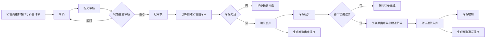
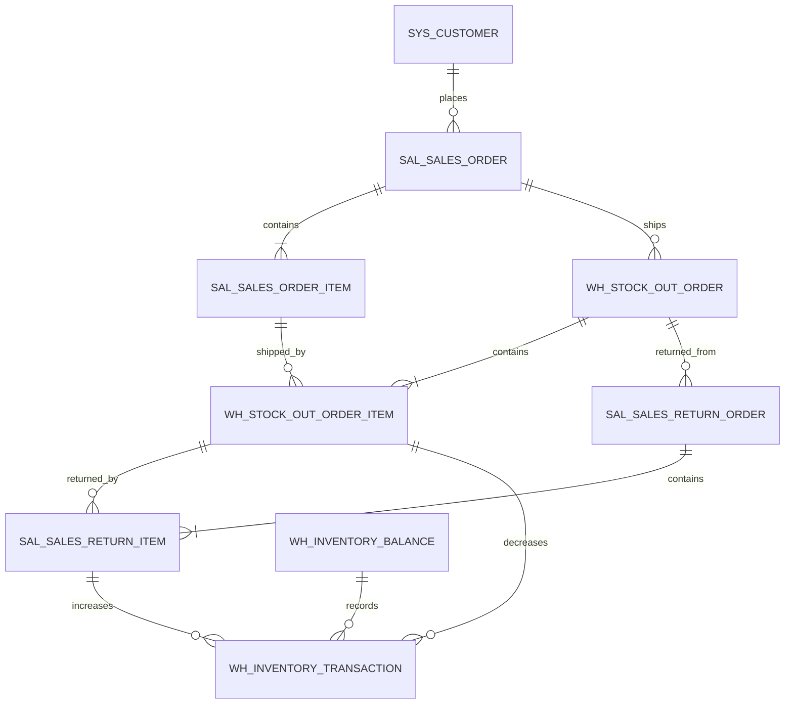

# 销售管理开发文档

| 项目 | 内容 |
| --- | --- |
| 文档版本 | V0.1（开发设计稿） |
| 对应需求 | [PRD.md](PRD.md) 的 SAL-01 ～ SAL-07 |
| 所属版本 | ERP V1 |
| 前置模块 | 商品档案、客户主数据、仓库主数据、用户与角色、库存余额与流水 |
| 关联模块 | 仓库管理、业务报表、系统设置 |
| 不包含 | 财务结算、发票、信用额度、复杂促销、批次/序列号管理 |

> 需求基线说明：本文件按你最新修改后的要求，将 **SAL-07 销售退货视为 V1 的 Must 需求**。当前 PRD 的“本期不包含”“V2 复杂业务能力”和“评审结论模板”中仍有销售退货属于 V2 的旧表述，正式开发前需要同步修改 PRD，避免需求基线冲突。

> 本文沿用《开发文档模板》的结构，并将“销售订单 → 销售出库 → 销售退货入库 → 库存流水”的闭环细化为开发、接口和测试依据。

# 业务背景

销售管理负责把客户需求转化为销售订单，经过销售主管审核后，由仓库按照订单实际发货出库。若客户拒收、商品质量不合格或数量发错，销售人员还需要根据原销售出库记录办理销售退货，使退回商品重新进入指定仓库，并留下可追溯的反向库存流水。

当前项目已有商品档案和库存预警演示，但尚未建立客户、销售订单、销售出库和销售退货单据。直接修改商品库存会导致以下问题：

- 无法确认某次库存减少对应哪一张销售单。
- 出库数量超过库存时可能产生负库存。
- 退货没有原出库单依据，无法判断客户是否确实购买过该商品。
- 销售数量、退货数量和库存变化无法相互核对。
- 销售订单审核、出库和退货缺少操作人及时间记录。

本模块要实现的业务闭环如下：



## 角色与职责

| 角色 | 可执行动作 | 不应拥有的权限 |
| --- | --- | --- |
| 系统管理员 | 管理客户资料、查看全部销售单据和日志 | 不应绕过销售单据直接修改库存 |
| 销售员 | 创建/编辑本人销售订单、提交、查看销售数据、发起退货申请 | 审核订单、确认出库、确认退货入库 |
| 销售主管 | 审核/驳回销售订单，查看全部销售单据，审批退货申请 | 直接修改已确认单据、确认库存变化 |
| 仓库管理员 | 查看已审核销售单，创建/确认出库，按原出库单确认退货入库 | 修改销售价格、审核销售订单 |
| 经营管理者 | 只读查看销售订单、出库、退货和报表 | 创建、审核、出入库 |

## 范围说明

### 本次开发范围

- 客户查询、新增、编辑、启停。
- 销售订单创建、编辑、删除、提交、审核、驳回、作废和查询。
- 选择发货仓库，实时提示可用库存。
- 基于已审核销售订单创建销售出库单，支持分批出库。
- 出库确认时校验库存、扣减库存、写入销售出库流水。
- 基于已确认销售出库单创建销售退货入库单。
- 退货数量校验、退货确认、库存增加和销售退货流水。
- 销售订单、出库单、退货单及销售数据的查询接口预留。

### 本次不包含

- 销售退款、应收账款、发票和财务凭证。
- 客户信用额度、价格等级、促销折扣和复杂税率。
- 跨仓库自动分配、库存预占、批次/序列号/质检状态。
- 退货质检、残次品仓、换货单和退货后退款审批；退货商品 V1 默认直接回到原发货仓的可用库存。

# 功能梳理

## 1. 功能清单

| 编号 | 功能 | 使用角色 | 说明 | 优先级 |
| --- | --- | --- | --- | --- |
| SAL-01 | 客户列表 | 系统管理员、销售员、销售主管 | 客户的查询、新增、编辑、启停 | Must |
| SAL-02 | 销售订单列表 | 销售员、销售主管、仓库管理员、经营管理者 | 按单号、客户、日期、状态筛选，展示出库进度 | Must |
| SAL-03 | 新建销售订单 | 销售员 | 选择客户、商品、发货仓库，填写数量、成交价和发货日期 | Must |
| SAL-04 | 可用库存提示 | 销售员、销售主管、仓库管理员 | 按商品+仓库展示可用库存；保存、提交、出库均由后端复核 | Must |
| SAL-05 | 提交与审核 | 销售员、销售主管 | 单级审核，通过或驳回必须可追溯 | Must |
| SAL-06 | 销售出库 | 仓库管理员 | 按已审核订单创建出库单，支持分批出库 | Must |
| SAL-07 | 销售退货 | 销售员、销售主管、仓库管理员 | 关联已确认销售出库单，将退回商品入库 | Must |
| SAL-08 | 销售数据导出 | 销售员、销售主管、经营管理者 | 按当前筛选条件导出 CSV | Should |

## 2. 页面与交互

### 2.1 客户列表

**入口**：系统设置 → 客户管理，销售管理中只提供选择和查询入口。

| 区域 | 字段/操作 | 规则 |
| --- | --- | --- |
| 查询区 | 客户编码、客户名称、联系人、电话、状态 | 支持模糊查询；状态为全部/启用/停用 |
| 列表区 | 编码、名称、联系人、电话、地址、状态、更新时间 | 默认按更新时间倒序 |
| 新增/编辑 | 编码、名称、联系人、联系电话、地址、备注、状态 | 编码、名称必填；编码全局唯一 |
| 操作区 | 编辑、启用/停用 | 已被销售订单引用只能停用，不能物理删除 |

停用客户后，历史销售单据继续展示客户快照；新建或提交销售订单时不得继续选择停用客户。

### 2.2 销售订单列表

**入口**：销售管理 → 销售订单。

| 区域 | 字段/操作 | 规则 |
| --- | --- | --- |
| 查询区 | 销售单号、客户、订单日期范围、状态、创建人 | 默认最近 30 天；日期范围最长 366 天 |
| 指标区 | 订单数、待审核数、待出库数、销售总额 | 按当前筛选条件统计 |
| 列表区 | 单号、客户、订单日期、销售金额、出库进度、状态、创建人 | 默认按创建时间倒序 |
| 操作区 | 查看、编辑、提交、审核、驳回、作废、创建出库、发起退货 | 只展示当前状态和角色允许的动作 |

### 2.3 新建/编辑销售订单

| 字段 | 必填 | 来源/输入方式 | 校验规则 |
| --- | --- | --- | --- |
| 销售单号 | 是 | 后端保存时生成 | 例如 `SO20260904-0001`，全局唯一 |
| 客户 | 是 | 选择启用客户 | 必须存在且状态为启用 |
| 发货仓库 | 是 | 选择启用仓库 | 必须存在且状态为启用 |
| 订单日期 | 是 | 默认当天，可选择 | 不晚于当前日期 |
| 要求发货日期 | 否 | 日期选择 | 不早于订单日期 |
| 备注 | 否 | 文本输入 | 最长 500 字符 |
| 商品 | 是 | 从启用商品档案选择 | 同一订单内商品不可重复 |
| 销售数量 | 是 | 数字输入 | 大于 0，最多 4 位小数 |
| 成交单价 | 是 | 数字输入 | 不小于 0，保留 2 位小数 |
| 行金额 | 是 | 系统计算 | `销售数量 × 成交单价` |
| 订单金额 | 是 | 系统汇总 | 所有行金额之和，后端重新计算 |

库存提示：选定商品和发货仓库后，前端显示当前可用库存，但提示文案必须包含“库存以确认出库时为准”。提示仅用于辅助下单，不代替后端校验。

### 2.4 销售订单状态

| 状态码 | 页面名称 | 含义 | 可执行动作 |
| --- | --- | --- | --- |
| `DRAFT` | 草稿 | 尚未提交 | 编辑、删除、提交 |
| `PENDING_APPROVAL` | 待审核 | 等待销售主管处理 | 审核通过、驳回 |
| `APPROVED` | 已审核 | 可以创建销售出库 | 创建出库、查看 |
| `REJECTED` | 已驳回 | 审核未通过 | 修改后重新提交 |
| `COMPLETED` | 已完成 | 所有销售数量已出库 | 查看、发起退货 |
| `VOIDED` | 已作废 | 不再继续执行 | 只读 |

V1 不单独增加“部分出库”状态，订单只要尚有未出库数量就保持“已审核”；列表通过“已出库/订单数量”展示执行进度。

### 2.5 销售出库

**入口**：销售管理 → 销售出库；或销售订单详情 → 创建出库单。

| 字段 | 必填 | 说明 | 校验规则 |
| --- | --- | --- | --- |
| 出库单号 | 是 | 系统生成，例如 `OUT20260904-0001` | 全局唯一，只读 |
| 来源销售单 | 是 | 选择已审核且未完成订单 | 必须关联销售订单 |
| 发货仓库 | 是 | 从销售订单带出 | V1 不允许在出库时更换仓库 |
| 出库日期 | 是 | 默认当天 | 不晚于当前日期 |
| 商品明细 | 是 | 从销售订单带出 | 不允许添加来源单外商品 |
| 本次出库数量 | 是 | 仓库填写 | 大于 0，不超过未出库数量和可用库存 |
| 可用库存 | 是 | 后端实时返回 | 只读，用于出库前提示 |
| 备注 | 否 | 文本输入 | 最长 500 字符 |

出库单状态：`DRAFT`（草稿）、`CONFIRMED`（已确认）、`VOIDED`（已作废）。确认后不能编辑或删除。

### 2.6 销售退货

**入口**：销售订单详情/销售出库单详情 → 发起销售退货。

退货必须从一张已确认的销售出库单发起，不允许只输入销售单号或商品编码直接退货。

| 字段 | 必填 | 说明 | 校验规则 |
| --- | --- | --- | --- |
| 退货单号 | 是 | 系统生成，例如 `RT20260904-0001` | 全局唯一，只读 |
| 来源销售出库单 | 是 | 选择已确认出库单 | 只能退已出库的商品 |
| 来源销售订单 | 是 | 由出库单带出 | 只读 |
| 退货仓库 | 是 | 默认原发货仓库 | V1 不允许更换仓库 |
| 退货日期 | 是 | 默认当天 | 不晚于当前日期 |
| 商品明细 | 是 | 从来源出库单带出 | 不允许添加来源单外商品 |
| 本次退货数量 | 是 | 销售人员/仓库人员填写 | 大于 0，不超过可退数量 |
| 退货原因 | 是 | 文本或下拉+备注 | 例如质量问题、数量错误、客户拒收 |
| 备注 | 否 | 文本输入 | 最长 500 字符 |

V1 默认退回商品为可用库存。后续如需“待检仓/残次品仓”，应增加退货质检状态和库存地点，不得在本规则上直接扩展隐式逻辑。

退货单状态：`DRAFT`（草稿）、`PENDING_APPROVAL`（待审核）、`APPROVED`（已审核）、`CONFIRMED`（已确认）、`REJECTED`（已驳回）、`VOIDED`（已作废）。为控制复杂度，V1 可先由仓库管理员确认退货；若业务要求销售主管审批，则启用待审核状态。

本开发文档默认采用以下 V1 退货流程：销售员创建草稿 → 销售主管审核 → 仓库确认退货入库。若团队决定取消退货审核，接口仍保留审核字段，状态可由草稿直接进入已审核。

### 2.7 退货数量展示

销售订单和销售出库详情展示：订单数量、累计出库数量、累计退货数量、可退数量。

计算规则：

```text
未出库数量 = 订单数量 - 累计出库数量
可退数量 = 累计出库数量 - 累计已确认退货数量
净销售数量 = 累计出库数量 - 累计已确认退货数量
```

销售订单即使全部出库后又发生退货，也仍保持“已完成”；退货通过退货单和净销售数量体现，不反向把原订单改回“已审核”。

# 数据库设计

## 1. 设计约定

1. 数据库使用 MySQL 8，字符集统一为 `utf8mb4`，排序规则使用 `utf8mb4_0900_ai_ci`。
2. 主键使用 `BIGINT UNSIGNED`；金额使用 `DECIMAL(18,2)`；数量使用 `DECIMAL(18,4)`。
3. 单据主表和明细表均保留创建、更新、逻辑删除字段；已确认单据不可物理删除。
4. 客户、商品、仓库和操作人保存 ID，同时保存名称/编码快照，保证历史单据在主数据变更后仍可读。
5. 所有库存变更必须和对应单据状态变更处在同一数据库事务中。
6. 退货流水属于库存入库流水，但业务类型必须与采购入库区分，使用 `SALES_RETURN`。

## 2. 表关系



## 3. 客户表

表名：`sys_customer`

| 字段名 | 数据类型 | 约束 | 注释 | 备注 |
| ------ | -------- | ---- | ---- | ---- |
| id | BIGINT UNSIGNED | PK，NOT NULL | 主键 |  |
| customer_code | VARCHAR(32) | NOT NULL，UNIQUE | 客户编码 | 例如 `CUS-0001` |
| customer_name | VARCHAR(120) | NOT NULL | 客户名称 |  |
| contact_name | VARCHAR(64) | NULL | 联系人 |  |
| contact_phone | VARCHAR(32) | NULL | 联系电话 |  |
| address | VARCHAR(255) | NULL | 地址 |  |
| status | VARCHAR(16) | NOT NULL | 状态 | `ENABLED` / `DISABLED` |
| remark | VARCHAR(500) | NULL | 备注 |  |
| deleted | TINYINT(1) | NOT NULL DEFAULT 0 | 逻辑删除 |  |
| created_at | DATETIME | NOT NULL | 创建时间 |  |
| created_by | BIGINT UNSIGNED | NOT NULL | 创建人 |  |
| updated_at | DATETIME | NOT NULL | 更新时间 |  |
| updated_by | BIGINT UNSIGNED | NOT NULL | 更新人 |  |

索引：`uk_customer_code(customer_code)`、`idx_customer_name(customer_name)`、`idx_customer_status(status, deleted)`。

## 4. 销售订单主表

表名：`sal_sales_order`

| 字段名 | 数据类型 | 约束 | 注释 | 备注 |
| ------ | -------- | ---- | ---- | ---- |
| id | BIGINT UNSIGNED | PK，NOT NULL | 主键 |  |
| order_no | VARCHAR(32) | NOT NULL，UNIQUE | 销售单号 | 例如 `SO20260904-0001` |
| customer_id | BIGINT UNSIGNED | NOT NULL | 客户 ID |  |
| customer_code | VARCHAR(32) | NOT NULL | 客户编码快照 |  |
| customer_name | VARCHAR(120) | NOT NULL | 客户名称快照 |  |
| warehouse_id | BIGINT UNSIGNED | NOT NULL | 发货仓库 ID | V1 单仓发货 |
| warehouse_code | VARCHAR(32) | NOT NULL | 仓库编码快照 |  |
| warehouse_name | VARCHAR(120) | NOT NULL | 仓库名称快照 |  |
| order_date | DATE | NOT NULL | 订单日期 |  |
| required_ship_date | DATE | NULL | 要求发货日期 |  |
| status | VARCHAR(32) | NOT NULL | 销售订单状态 | 见状态表 |
| total_quantity | DECIMAL(18,4) | NOT NULL | 订单总数量 | 后端汇总 |
| shipped_quantity | DECIMAL(18,4) | NOT NULL DEFAULT 0 | 累计出库数量 | 由确认出库更新 |
| returned_quantity | DECIMAL(18,4) | NOT NULL DEFAULT 0 | 累计退货数量 | 由确认退货更新 |
| total_amount | DECIMAL(18,2) | NOT NULL | 订单总金额 | 后端汇总 |
| remark | VARCHAR(500) | NULL | 备注 |  |
| approval_comment | VARCHAR(500) | NULL | 审核意见 | 驳回时必填 |
| submitted_at | DATETIME | NULL | 提交时间 |  |
| submitted_by | BIGINT UNSIGNED | NULL | 提交人 |  |
| approved_at | DATETIME | NULL | 审核时间 |  |
| approved_by | BIGINT UNSIGNED | NULL | 审核人 |  |
| version | INT UNSIGNED | NOT NULL DEFAULT 0 | 乐观锁版本 | 并发修改控制 |
| deleted | TINYINT(1) | NOT NULL DEFAULT 0 | 逻辑删除 |  |
| created_at | DATETIME | NOT NULL | 创建时间 |  |
| created_by | BIGINT UNSIGNED | NOT NULL | 创建人 |  |
| updated_at | DATETIME | NOT NULL | 更新时间 |  |
| updated_by | BIGINT UNSIGNED | NOT NULL | 更新人 |  |

索引：`uk_sales_order_no(order_no)`、`idx_sales_customer_date(customer_id, order_date)`、`idx_sales_status_date(status, order_date)`、`idx_sales_warehouse(warehouse_id, status)`。

## 5. 销售订单明细表

表名：`sal_sales_order_item`

| 字段名 | 数据类型 | 约束 | 注释 | 备注 |
| ------ | -------- | ---- | ---- | ---- |
| id | BIGINT UNSIGNED | PK，NOT NULL | 主键 |  |
| sales_order_id | BIGINT UNSIGNED | NOT NULL | 销售订单 ID |  |
| line_no | INT UNSIGNED | NOT NULL | 行号 | 同单唯一 |
| product_id | BIGINT UNSIGNED | NOT NULL | 商品 ID |  |
| product_sku | VARCHAR(32) | NOT NULL | 商品编码快照 |  |
| product_name | VARCHAR(120) | NOT NULL | 商品名称快照 |  |
| unit | VARCHAR(16) | NOT NULL | 单位快照 |  |
| ordered_quantity | DECIMAL(18,4) | NOT NULL | 销售数量 | > 0 |
| shipped_quantity | DECIMAL(18,4) | NOT NULL DEFAULT 0 | 累计出库数量 |  |
| returned_quantity | DECIMAL(18,4) | NOT NULL DEFAULT 0 | 累计退货数量 |  |
| unit_price | DECIMAL(18,2) | NOT NULL | 成交单价 | >= 0 |
| line_amount | DECIMAL(18,2) | NOT NULL | 行金额 | 数量 × 单价 |
| created_at | DATETIME | NOT NULL | 创建时间 |  |
| created_by | BIGINT UNSIGNED | NOT NULL | 创建人 |  |
| updated_at | DATETIME | NOT NULL | 更新时间 |  |
| updated_by | BIGINT UNSIGNED | NOT NULL | 更新人 |  |

约束：`UNIQUE(sales_order_id, line_no)`、`UNIQUE(sales_order_id, product_id)`；索引 `idx_sales_item_product(product_id)`。

## 6. 销售出库单主表

表名：`wh_stock_out_order`

| 字段名 | 数据类型 | 约束 | 注释 | 备注 |
| ------ | -------- | ---- | ---- | ---- |
| id | BIGINT UNSIGNED | PK，NOT NULL | 主键 |  |
| stock_out_no | VARCHAR(32) | NOT NULL，UNIQUE | 出库单号 | 例如 `OUT20260904-0001` |
| source_order_id | BIGINT UNSIGNED | NOT NULL | 来源销售订单 ID |  |
| source_order_no | VARCHAR(32) | NOT NULL | 来源销售单号快照 |  |
| customer_id | BIGINT UNSIGNED | NOT NULL | 客户 ID |  |
| customer_name | VARCHAR(120) | NOT NULL | 客户名称快照 |  |
| warehouse_id | BIGINT UNSIGNED | NOT NULL | 发货仓库 ID | 退货默认回此仓 |
| warehouse_name | VARCHAR(120) | NOT NULL | 仓库名称快照 |  |
| stock_out_date | DATE | NOT NULL | 出库日期 |  |
| status | VARCHAR(16) | NOT NULL | 出库状态 | `DRAFT` / `CONFIRMED` / `VOIDED` |
| total_quantity | DECIMAL(18,4) | NOT NULL | 本次出库总量 |  |
| remark | VARCHAR(500) | NULL | 备注 |  |
| confirmed_at | DATETIME | NULL | 确认时间 |  |
| confirmed_by | BIGINT UNSIGNED | NULL | 确认人 |  |
| version | INT UNSIGNED | NOT NULL DEFAULT 0 | 乐观锁版本 |  |
| deleted | TINYINT(1) | NOT NULL DEFAULT 0 | 逻辑删除 |  |
| created_at | DATETIME | NOT NULL | 创建时间 |  |
| created_by | BIGINT UNSIGNED | NOT NULL | 创建人 |  |
| updated_at | DATETIME | NOT NULL | 更新时间 |  |
| updated_by | BIGINT UNSIGNED | NOT NULL | 更新人 |  |

索引：`uk_stock_out_no(stock_out_no)`、`idx_stock_out_source(source_order_id)`、`idx_stock_out_warehouse_date(warehouse_id, stock_out_date)`、`idx_stock_out_status(status)`。

## 7. 销售出库单明细表

表名：`wh_stock_out_order_item`

| 字段名 | 数据类型 | 约束 | 注释 | 备注 |
| ------ | -------- | ---- | ---- | ---- |
| id | BIGINT UNSIGNED | PK，NOT NULL | 主键 |  |
| stock_out_order_id | BIGINT UNSIGNED | NOT NULL | 出库单 ID |  |
| sales_order_item_id | BIGINT UNSIGNED | NOT NULL | 来源销售订单明细 | 关联出库进度 |
| line_no | INT UNSIGNED | NOT NULL | 行号 |  |
| product_id | BIGINT UNSIGNED | NOT NULL | 商品 ID |  |
| product_sku | VARCHAR(32) | NOT NULL | 商品编码快照 |  |
| product_name | VARCHAR(120) | NOT NULL | 商品名称快照 |  |
| unit | VARCHAR(16) | NOT NULL | 单位快照 |  |
| shipped_quantity | DECIMAL(18,4) | NOT NULL | 本次出库数量 | > 0 |
| unit_price | DECIMAL(18,2) | NOT NULL | 销售单价快照 |  |
| created_at | DATETIME | NOT NULL | 创建时间 |  |
| created_by | BIGINT UNSIGNED | NOT NULL | 创建人 |  |

约束：`UNIQUE(stock_out_order_id, line_no)`；索引 `idx_stock_out_item_sales_item(sales_order_item_id)`、`idx_stock_out_item_product(product_id)`。

## 8. 销售退货单主表

表名：`sal_sales_return_order`

| 字段名 | 数据类型 | 约束 | 注释 | 备注 |
| ------ | -------- | ---- | ---- | ---- |
| id | BIGINT UNSIGNED | PK，NOT NULL | 主键 |  |
| return_no | VARCHAR(32) | NOT NULL，UNIQUE | 退货单号 | 例如 `RT20260904-0001` |
| source_stock_out_id | BIGINT UNSIGNED | NOT NULL | 来源销售出库单 ID | 必须已确认 |
| source_stock_out_no | VARCHAR(32) | NOT NULL | 来源出库单号快照 |  |
| source_sales_order_id | BIGINT UNSIGNED | NOT NULL | 来源销售订单 ID |  |
| source_sales_order_no | VARCHAR(32) | NOT NULL | 来源销售单号快照 |  |
| customer_id | BIGINT UNSIGNED | NOT NULL | 客户 ID |  |
| customer_name | VARCHAR(120) | NOT NULL | 客户名称快照 |  |
| warehouse_id | BIGINT UNSIGNED | NOT NULL | 退货入库仓库 ID | 默认原发货仓 |
| warehouse_name | VARCHAR(120) | NOT NULL | 仓库名称快照 |  |
| return_date | DATE | NOT NULL | 退货日期 |  |
| status | VARCHAR(24) | NOT NULL | 退货状态 | 见退货状态表 |
| total_quantity | DECIMAL(18,4) | NOT NULL | 本次退货总量 |  |
| reason | VARCHAR(32) | NOT NULL | 退货原因 | 质量问题/数量错误/客户拒收等 |
| remark | VARCHAR(500) | NULL | 备注 |  |
| approval_comment | VARCHAR(500) | NULL | 审核意见 |  |
| approved_at | DATETIME | NULL | 审核时间 |  |
| approved_by | BIGINT UNSIGNED | NULL | 审核人 |  |
| confirmed_at | DATETIME | NULL | 确认入库时间 |  |
| confirmed_by | BIGINT UNSIGNED | NULL | 确认人 |  |
| version | INT UNSIGNED | NOT NULL DEFAULT 0 | 乐观锁版本 |  |
| deleted | TINYINT(1) | NOT NULL DEFAULT 0 | 逻辑删除 |  |
| created_at | DATETIME | NOT NULL | 创建时间 |  |
| created_by | BIGINT UNSIGNED | NOT NULL | 创建人 |  |
| updated_at | DATETIME | NOT NULL | 更新时间 |  |
| updated_by | BIGINT UNSIGNED | NOT NULL | 更新人 |  |

索引：`uk_return_no(return_no)`、`idx_return_source_out(source_stock_out_id)`、`idx_return_sales_order(source_sales_order_id)`、`idx_return_status_date(status, return_date)`。

## 9. 销售退货单明细表

表名：`sal_sales_return_item`

| 字段名 | 数据类型 | 约束 | 注释 | 备注 |
| ------ | -------- | ---- | ---- | ---- |
| id | BIGINT UNSIGNED | PK，NOT NULL | 主键 |  |
| return_order_id | BIGINT UNSIGNED | NOT NULL | 退货单 ID |  |
| source_stock_out_item_id | BIGINT UNSIGNED | NOT NULL | 来源出库明细 ID | 可退数量依据 |
| source_sales_order_item_id | BIGINT UNSIGNED | NOT NULL | 来源销售明细 ID | 更新销售退货数量 |
| line_no | INT UNSIGNED | NOT NULL | 行号 |  |
| product_id | BIGINT UNSIGNED | NOT NULL | 商品 ID |  |
| product_sku | VARCHAR(32) | NOT NULL | 商品编码快照 |  |
| product_name | VARCHAR(120) | NOT NULL | 商品名称快照 |  |
| unit | VARCHAR(16) | NOT NULL | 单位快照 |  |
| returned_quantity | DECIMAL(18,4) | NOT NULL | 本次退货数量 | > 0 |
| unit_price | DECIMAL(18,2) | NOT NULL | 原销售单价快照 | 用于统计，不做退款 |
| created_at | DATETIME | NOT NULL | 创建时间 |  |
| created_by | BIGINT UNSIGNED | NOT NULL | 创建人 |  |

约束：`UNIQUE(return_order_id, line_no)`；索引 `idx_return_item_source_out(source_stock_out_item_id)`、`idx_return_item_sales_item(source_sales_order_item_id)`。

## 10. 库存余额与流水表

采购管理开发文档中定义的 `wh_inventory_balance` 和 `wh_inventory_transaction` 为销售模块共用表。销售模块需要遵守以下约定：

| 业务动作 | `transaction_type` | `change_quantity` | 影响 |
| --- | --- | --- | --- |
| 销售出库确认 | `SALES_SHIPMENT` | 负数 | 现存数量减少 |
| 销售退货确认 | `SALES_RETURN` | 正数 | 现存数量增加 |

流水来源分别指向销售出库明细和销售退货明细，并以来源明细 ID 建立幂等唯一约束，防止重复确认造成重复扣减或增加。

# 业务逻辑

## 1. 客户管理

### 1.1 新增与编辑

1. 管理员输入客户编码、名称和联系方式。
2. 后端校验客户编码在未删除数据中唯一。
3. 客户状态只能是 `ENABLED` 或 `DISABLED`。
4. 已被销售订单引用的客户只能停用，不能物理删除。

### 1.2 启停

1. 停用客户不影响历史销售订单、出库单和退货单的显示。
2. 新建销售订单、编辑草稿和提交订单时都必须再次校验客户为启用状态。

## 2. 创建与保存销售订单

1. 销售员进入新建页面，加载启用客户、启用商品和启用仓库。
2. 用户填写表头和至少一行销售明细；前端实时计算金额和库存提示。
3. 后端重新读取商品、客户、仓库的最新信息，不信任前端传入的名称、单位、金额和可用库存。
4. 同一订单不允许重复商品；商品、客户或仓库停用时拒绝保存。
5. 后端使用服务端价格计算行金额和订单总额，金额统一保留两位小数。
6. 初次保存时生成销售单号；订单状态为 `DRAFT`。
7. 仅 `DRAFT`、`REJECTED` 允许编辑和删除；其他状态只读。
8. 更新时校验 `version`，发生并发更新返回“销售订单已被他人修改，请刷新后重试”。

## 3. 提交销售订单

1. 前置状态只能是 `DRAFT` 或 `REJECTED`。
2. 校验客户、商品、仓库均启用，明细不为空，数量和价格合法，日期合法。
3. 校验通过后更新为 `PENDING_APPROVAL`，记录提交人和提交时间。
4. V1 不在提交或审核时扣库存，也不锁定库存；页面须提示库存以实际出库为准。

## 4. 审核与驳回

### 4.1 审核通过

1. 只有销售主管可以审核，前置状态必须为 `PENDING_APPROVAL`。
2. 更新为 `APPROVED`，记录审核人、审核时间和审核意见。
3. 审核只改变业务状态，不改变库存。
4. 使用“订单 ID + 当前状态 + version”条件更新，避免重复审核。

### 4.2 驳回

1. 只有销售主管可以驳回，前置状态必须为 `PENDING_APPROVAL`。
2. 驳回原因必填，最大 500 字符。
3. 更新为 `REJECTED`；销售员可修改后再次提交，审核意见保留在历史日志中。

## 5. 创建销售出库单

1. 仓库管理员只能从 `APPROVED` 且存在未出库数量的销售订单创建出库单。
2. 出库仓库由销售订单带出，不允许在出库页面切换仓库。
3. 后端返回订单每一行的“订单数量、累计出库数量、未出库数量、当前可用库存”。
4. 本次出库数量必须大于 0，且不超过未出库数量。
5. 允许一张销售订单分多次创建出库单；每次确认前都重新读取库存。

## 6. 确认销售出库（核心事务）

确认销售出库必须在单一数据库事务中执行：

1. 校验当前用户为仓库管理员，出库单状态为 `DRAFT`。
2. 锁定出库单、销售订单和销售订单明细。
3. 对每一行重新计算未出库数量，校验本次数量不超额。
4. 锁定 `wh_inventory_balance(product_id, warehouse_id)`。
5. 校验可用库存大于或等于本次出库数量；任一商品不足则整单失败。
6. 记录库存变动前数量，并将现存数量、可用数量扣减本次出库量。
7. 更新销售订单明细和主表的累计出库数量。
8. 将出库单改为 `CONFIRMED`，记录确认人和确认时间。
9. 每个出库明细生成一条 `SALES_SHIPMENT` 流水，变动数量为负数。
10. 若所有销售明细均已全部出库，将销售订单改为 `COMPLETED`；否则保持 `APPROVED`。

幂等要求：已确认出库单再次确认必须失败；数据库以 `transaction_type + source_line_id` 的唯一约束阻止重复扣库存。

## 7. 销售退货流程（SAL-07）

### 7.1 创建退货单草稿

1. 销售员在已确认销售出库单详情中点击“发起退货”。
2. 后端加载该出库单的商品、出库数量、历史已退数量，并计算每一行可退数量。
3. 只有可退数量大于 0 的商品可以选择；退货单不得混入其他出库单商品。
4. 退货仓库默认原发货仓库；V1 禁止改到其他仓库。
5. 退货原因必填，至少一条明细，数量大于 0 且不超过实时可退数量。
6. 保存后退货单状态为 `DRAFT`，不会改变库存和销售订单数量。

### 7.2 审核退货单

1. 销售主管审核 `DRAFT` 或待审核退货单；是否经过待审核状态由最终业务确认。
2. 驳回必须填写原因；驳回后销售员可以修改并重新提交。
3. 审核通过只改变退货单状态，不增加库存；库存变化发生在确认退货入库时。

### 7.3 确认退货入库（核心事务）

确认退货必须在单一数据库事务中执行：

1. 校验当前用户为仓库管理员，退货单状态为 `APPROVED`（若取消退货审核，则允许 `DRAFT`）。
2. 锁定退货单、来源出库单、来源出库明细和对应销售订单明细。
3. 对每一行重新计算：`可退数量 = 出库数量 - 已确认退货数量`。
4. 校验本次退货数量不超过可退数量；失败则整单回滚。
5. 锁定退货仓库对应的库存余额记录并记录变动前数量。
6. 将现存数量、可用数量增加退货数量。
7. 更新来源出库明细的累计退货数量，并更新销售订单明细/主表的累计退货数量。
8. 将退货单改为 `CONFIRMED`，记录确认人和确认时间。
9. 每个退货明细生成一条 `SALES_RETURN` 流水，变动数量为正数。
10. 提交事务后，销售订单状态保持原状态；订单详情的净销售数量和可退数量刷新。

幂等要求：已确认退货单不可再次确认；同一退货明细只允许生成一条销售退货流水。

### 7.4 退货与库存的业务边界

- V1 退货商品默认可直接销售，因此回到原发货仓的可用库存。
- V1 不处理退款金额，只记录原成交单价供销售报表统计。
- 退货不能超过原出库数量；“客户买一送一”“换货补发”等特殊场景不在 V1 自动推导。
- 退货不能直接冲销原销售出库流水，必须新增正向 `SALES_RETURN` 流水。

## 8. 作废规则

| 单据 | 可作废状态 | 限制 |
| --- | --- | --- |
| 销售订单 | 草稿、已驳回、待审核、已审核且无出库 | 已发生出库后不可作废 |
| 销售出库单 | 仅草稿 | 已确认后库存已减少，不允许直接作废 |
| 销售退货单 | 草稿、已驳回、待审核/已审核但未确认 | 已确认后库存已增加，不允许直接作废 |

已确认单据如果需要反向处理，必须通过新的退货或后续红字业务，不得删除或直接改数量。

## 9. 查询、统计与导出

1. 销售订单列表按权限返回数据；销售员默认只看自己创建的订单，主管和仓库按授权范围查看。
2. 销售金额以销售订单金额为基础；退货金额在 V1 仅作为参考统计，不代表退款或应收冲销。
3. 销售数量报表应同时展示出库数量、退货数量和净销售数量。
4. CSV 导出使用 UTF-8 编码，并导出当前筛选条件下的记录。
5. 报表只统计已确认出库和已确认退货，草稿、待审核、已驳回不计入库存变化。

## 10. 异常处理与提示

| 场景 | 错误码建议 | 用户提示 |
| --- | --- | --- |
| 客户编码重复 | `CUSTOMER_CODE_DUPLICATE` | 客户编码已存在，请更换后重试 |
| 客户/商品/仓库停用 | `MASTER_DATA_DISABLED` | 所选基础资料已停用，请重新选择 |
| 订单状态不允许 | `SALES_ORDER_STATUS_INVALID` | 当前销售订单状态不允许此操作 |
| 出库库存不足 | `INSUFFICIENT_STOCK` | 商品可用库存不足，无法确认出库 |
| 出库数量超额 | `SHIPMENT_QUANTITY_EXCEEDED` | 本次出库数量超过订单未出库数量 |
| 退货来源未确认 | `RETURN_SOURCE_NOT_CONFIRMED` | 只有已确认的销售出库单可以退货 |
| 退货数量超额 | `RETURN_QUANTITY_EXCEEDED` | 本次退货数量超过来源出库单可退数量 |
| 退货单已确认 | `RETURN_ALREADY_CONFIRMED` | 退货单已确认，不能重复入库 |
| 状态/版本冲突 | `DATA_VERSION_CONFLICT` | 数据已被他人更新，请刷新后重试 |

# 相关接口

## 1. 接口通用约定

1. 基础路径为 `/api`，请求和响应使用 JSON。
2. 需要登录的接口通过 `Authorization: Bearer <token>` 传递令牌；登录模块未完成前可用开发身份模拟，但后端应保留权限校验入口。
3. 成功响应建议统一为 `{ "code": "OK", "message": "success", "data": ... }`。
4. 失败响应建议统一为 `{ "code": "错误码", "message": "用户可读错误", "fieldErrors": [] }`。
5. 分页参数：`page` 从 1 开始，`pageSize` 默认 20、最大 100。

## 2. 客户接口

| 对应的功能 | 内容 |
| ---------- | ---- |
| 查询客户 | `GET /api/customers?keyword=&status=&page=1&pageSize=20` |
| 参数 | `keyword`、`status`、分页均可选；状态为 `ENABLED` / `DISABLED` |
| 返回 | 分页客户列表，包含编码、名称、联系人、电话、状态 |

| 对应的功能 | 内容 |
| ---------- | ---- |
| 新增客户 | `POST /api/customers` |
| 参数 | `{ "customerCode": "CUS-0001", "customerName": "华东零售有限公司", "contactName": "李敏", "contactPhone": "13900000001", "address": "上海市…", "status": "ENABLED", "remark": "" }` |
| 返回 | 新建客户详情，HTTP `201` |

| 对应的功能 | 内容 |
| ---------- | ---- |
| 编辑客户 | `PUT /api/customers/{id}` |
| 参数 | 路径参数 `id`；请求体同新增 |
| 返回 | 更新后的客户详情 |

| 对应的功能 | 内容 |
| ---------- | ---- |
| 启停客户 | `PATCH /api/customers/{id}/status` |
| 参数 | `{ "status": "DISABLED" }` |
| 返回 | 更新后的客户状态 |

## 3. 销售订单接口

| 对应的功能 | 内容 |
| ---------- | ---- |
| 查询销售订单 | `GET /api/sales-orders?orderNo=&customerId=&warehouseId=&status=&dateFrom=&dateTo=&page=1&pageSize=20` |
| 参数 | 单号、客户、仓库、状态、日期和分页均可选 |
| 返回 | 分页列表：单号、客户、金额、订单数量、已出库数量、退货数量、进度、状态 |

| 对应的功能 | 内容 |
| ---------- | ---- |
| 查询销售订单详情 | `GET /api/sales-orders/{id}` |
| 参数 | 路径参数 `id` |
| 返回 | 表头、客户/仓库快照、审核信息、订单明细及每行出库/退货/可退数量 |

| 对应的功能 | 内容 |
| ---------- | ---- |
| 创建销售订单草稿 | `POST /api/sales-orders` |
| 参数 | 客户、仓库、订单日期、要求发货日期、备注和至少一行 `items` |
| 返回 | 草稿详情，HTTP `201` |

请求示例：

```json
{
  "customerId": 6001,
  "warehouseId": 4001,
  "orderDate": "2026-09-04",
  "requiredShipDate": "2026-09-06",
  "remark": "客户月度办公用品采购",
  "items": [
    { "productId": 2001, "orderedQuantity": 10, "unitPrice": 29.90 },
    { "productId": 2002, "orderedQuantity": 20, "unitPrice": 3.50 }
  ]
}
```

| 对应的功能 | 内容 |
| ---------- | ---- |
| 编辑销售订单 | `PUT /api/sales-orders/{id}` |
| 参数 | 路径参数 `id`；请求体同创建，增加 `version`；仅草稿/已驳回可编辑 |
| 返回 | 更新后的销售订单详情 |

| 对应的功能 | 内容 |
| ---------- | ---- |
| 删除草稿 | `DELETE /api/sales-orders/{id}` |
| 参数 | 路径参数 `id`；仅草稿可删除 |
| 返回 | HTTP `204` |

| 对应的功能 | 内容 |
| ---------- | ---- |
| 提交审核 | `POST /api/sales-orders/{id}/submit` |
| 参数 | 可选请求体 `{ "version": 1 }` |
| 返回 | 状态为 `PENDING_APPROVAL` 的销售订单 |

| 对应的功能 | 内容 |
| ---------- | ---- |
| 审核通过 | `POST /api/sales-orders/{id}/approve` |
| 参数 | `{ "version": 2, "comment": "同意发货" }` |
| 返回 | 状态为 `APPROVED` 的销售订单 |

| 对应的功能 | 内容 |
| ---------- | ---- |
| 驳回订单 | `POST /api/sales-orders/{id}/reject` |
| 参数 | `{ "version": 2, "comment": "请确认客户收货地址" }`；意见必填 |
| 返回 | 状态为 `REJECTED` 的销售订单 |

| 对应的功能 | 内容 |
| ---------- | ---- |
| 作废订单 | `POST /api/sales-orders/{id}/void` |
| 参数 | `{ "version": 2, "comment": "客户取消订单" }` |
| 返回 | 状态为 `VOIDED` 的销售订单 |

## 4. 可用库存接口

| 对应的功能 | 内容 |
| ---------- | ---- |
| 查询指定商品库存 | `GET /api/inventory/available?productId={productId}&warehouseId={warehouseId}` |
| 参数 | 商品 ID、仓库 ID 必填 |
| 返回 | `{ "productId": 2001, "warehouseId": 4001, "onHandQuantity": 80, "lockedQuantity": 0, "availableQuantity": 80 }` |

| 对应的功能 | 内容 |
| ---------- | ---- |
| 批量查询可用库存 | `POST /api/inventory/available/batch` |
| 参数 | `{ "warehouseId": 4001, "productIds": [2001, 2002] }` |
| 返回 | 每个商品的现存、锁定和可用数量 |

## 5. 销售出库接口

| 对应的功能 | 内容 |
| ---------- | ---- |
| 查询可出库订单 | `GET /api/sales-orders/shippable?orderNo=&customerId=&page=1&pageSize=20` |
| 参数 | 仅返回已审核且存在未出库数量的订单 |
| 返回 | 订单及明细的订单数量、累计出库、未出库、可用库存 |

| 对应的功能 | 内容 |
| ---------- | ---- |
| 查询出库单 | `GET /api/stock-out-orders?stockOutNo=&salesOrderId=&warehouseId=&status=&page=1&pageSize=20` |
| 参数 | 筛选与分页均可选 |
| 返回 | 分页出库单列表 |

| 对应的功能 | 内容 |
| ---------- | ---- |
| 创建销售出库草稿 | `POST /api/stock-out-orders` |
| 参数 | 来源销售订单、出库日期、明细；明细包含 `salesOrderItemId` 和 `shippedQuantity` |
| 返回 | 出库单草稿详情，HTTP `201` |

请求示例：

```json
{
  "salesOrderId": 7001,
  "stockOutDate": "2026-09-05",
  "remark": "首批发货",
  "items": [
    { "salesOrderItemId": 7101, "shippedQuantity": 5 },
    { "salesOrderItemId": 7102, "shippedQuantity": 20 }
  ]
}
```

| 对应的功能 | 内容 |
| ---------- | ---- |
| 查询出库单详情 | `GET /api/stock-out-orders/{id}` |
| 参数 | 路径参数 `id` |
| 返回 | 出库表头、来源销售单、仓库、明细、确认信息和可退数量 |

| 对应的功能 | 内容 |
| ---------- | ---- |
| 确认销售出库 | `POST /api/stock-out-orders/{id}/confirm` |
| 参数 | 可选请求体 `{ "version": 0 }` |
| 返回 | 已确认出库单、更新后的销售订单进度；库存不足返回 `INSUFFICIENT_STOCK` |

## 6. 销售退货接口（SAL-07）

| 对应的功能 | 内容 |
| ---------- | ---- |
| 查询可退出库单 | `GET /api/stock-out-orders/returnable?customerId=&salesOrderId=&page=1&pageSize=20` |
| 参数 | 可选客户、销售单和分页参数；只返回存在可退商品的已确认出库单 |
| 返回 | 出库单及明细的已出库、已退货、可退数量 |

| 对应的功能 | 内容 |
| ---------- | ---- |
| 查询销售退货单 | `GET /api/sales-returns?returnNo=&salesOrderId=&stockOutId=&status=&dateFrom=&dateTo=&page=1&pageSize=20` |
| 参数 | 退货单号、来源销售单/出库单、状态、日期和分页均可选 |
| 返回 | 分页退货单列表，包含客户、来源出库单、仓库、退货数量、原因、状态 |

| 对应的功能 | 内容 |
| ---------- | ---- |
| 查询退货单详情 | `GET /api/sales-returns/{id}` |
| 参数 | 路径参数 `id` |
| 返回 | 退货表头、来源订单/出库单、明细及每行可退数量 |

| 对应的功能 | 内容 |
| ---------- | ---- |
| 创建退货草稿 | `POST /api/sales-returns` |
| 参数 | 来源出库单、退货日期、退货原因、备注、明细；明细包含 `sourceStockOutItemId` 和 `returnedQuantity` |
| 返回 | 退货草稿详情，HTTP `201` |

请求示例：

```json
{
  "sourceStockOutId": 8001,
  "returnDate": "2026-09-08",
  "reason": "质量问题",
  "remark": "客户反馈其中 2 件外观破损",
  "items": [
    { "sourceStockOutItemId": 8101, "returnedQuantity": 2 }
  ]
}
```

| 对应的功能 | 内容 |
| ---------- | ---- |
| 提交退货审核 | `POST /api/sales-returns/{id}/submit` |
| 参数 | `{ "version": 0 }`；若取消退货审核，该接口可省略 |
| 返回 | 状态为 `PENDING_APPROVAL` 的退货单 |

| 对应的功能 | 内容 |
| ---------- | ---- |
| 审核退货 | `POST /api/sales-returns/{id}/approve` |
| 参数 | `{ "version": 1, "comment": "同意退回主仓" }` |
| 返回 | 状态为 `APPROVED` 的退货单 |

| 对应的功能 | 内容 |
| ---------- | ---- |
| 驳回退货 | `POST /api/sales-returns/{id}/reject` |
| 参数 | `{ "version": 1, "comment": "请补充退货照片" }`；意见必填 |
| 返回 | 状态为 `REJECTED` 的退货单 |

| 对应的功能 | 内容 |
| ---------- | ---- |
| 确认退货入库 | `POST /api/sales-returns/{id}/confirm` |
| 参数 | `{ "version": 2 }` |
| 返回 | 已确认退货单；库存增加并生成 `SALES_RETURN` 流水 |

| 对应的功能 | 内容 |
| ---------- | ---- |
| 作废退货草稿 | `POST /api/sales-returns/{id}/void` |
| 参数 | `{ "version": 2, "comment": "客户取消退货" }`；已确认退货不能作废 |
| 返回 | 状态为 `VOIDED` 的退货单 |

## 7. 销售报表接口

| 对应的功能 | 内容 |
| ---------- | ---- |
| 销售汇总 | `GET /api/reports/sales-summary?dateFrom=&dateTo=&customerId=&warehouseId=` |
| 参数 | 日期范围必填或使用当前月默认值；客户、仓库可选 |
| 返回 | 订单数、销售金额、出库数量、退货数量、净销售数量 |

| 对应的功能 | 内容 |
| ---------- | ---- |
| 销售明细导出 | `GET /api/reports/sales-detail/export?...` |
| 参数 | 与销售订单列表筛选条件一致 |
| 返回 | UTF-8 CSV 文件，包含销售单、出库单和退货关联信息 |

## 8. 接口权限矩阵

| 接口类别 | 系统管理员 | 销售员 | 销售主管 | 仓库管理员 | 经营管理者 |
| --- | --- | --- | --- | --- | --- |
| 客户维护 | 是 | 只读 | 只读 | 只读 | 只读 |
| 创建/编辑/删除销售单 | 否 | 仅本人草稿/驳回 | 否 | 否 | 否 |
| 提交销售单 | 否 | 仅本人 | 否 | 否 | 否 |
| 审核/驳回销售单 | 否 | 否 | 是 | 否 | 否 |
| 创建/确认销售出库 | 否 | 否 | 否 | 是 | 否 |
| 创建退货草稿 | 否 | 是 | 是 | 可按流程 | 否 |
| 审核退货 | 否 | 否 | 是 | 否 | 否 |
| 确认退货入库 | 否 | 否 | 否 | 是 | 否 |
| 查询销售、出库、退货 | 是 | 仅本人/授权范围 | 是 | 是 | 是 |

# 开发与测试检查清单

## 后端

- [ ] 建立客户、销售订单、销售明细、销售出库、出库明细、销售退货、退货明细表。
- [ ] 复用库存余额和库存流水表，定义 `SALES_SHIPMENT` 与 `SALES_RETURN` 两种业务类型。
- [ ] 对订单、出库、退货分别实现状态机和权限校验。
- [ ] 确认销售出库使用事务，库存不足时整单回滚。
- [ ] 确认销售退货使用事务，退货超额时整单回滚。
- [ ] 为出库明细和退货明细建立库存流水幂等唯一约束。
- [ ] 所有金额使用 `BigDecimal`，后端重新计算订单/行金额。
- [ ] 记录提交、审核、驳回、作废、出库、退货确认操作日志。

## 前端

- [ ] 增加客户管理、销售订单、销售出库、销售退货页面和路由。
- [ ] 销售订单表单支持客户、发货仓、商品明细、库存提示和金额计算。
- [ ] 出库页面显示订单数量、已出库、未出库、可用库存并支持分批出库。
- [ ] 退货页面必须从已确认出库单进入，显示已出库、已退货、可退数量。
- [ ] 审核、驳回、作废、确认出库、确认退货均提供二次确认。
- [ ] 退货原因必填，退货数量超过可退数量时在前端提示并由后端再次拦截。
- [ ] 销售订单详情刷新出库进度、退货数量和净销售数量。

## 验收测试

| 编号 | 测试场景 | 预期结果 |
| --- | --- | --- |
| SAL-TC-01 | 新增客户后使用重复编码保存 | 保存失败并提示客户编码重复 |
| SAL-TC-02 | 创建含两种商品的销售订单 | 单号生成，订单金额和库存提示正确 |
| SAL-TC-03 | 提交订单后编辑 | 编辑被拒绝，订单保持待审核 |
| SAL-TC-04 | 销售主管不填原因直接驳回 | 驳回失败，要求填写审核意见 |
| SAL-TC-05 | 审核通过后创建出库单 | 只出现已审核且有未出库数量的订单 |
| SAL-TC-06 | 分两次确认销售出库 | 库存分两次扣减，销售订单进度正确 |
| SAL-TC-07 | 可用库存不足确认出库 | 操作失败，库存、订单进度、流水均不变化 |
| SAL-TC-08 | 重复确认同一出库单 | 第二次失败，不重复扣减库存 |
| SAL-TC-09 | 从未确认出库单发起退货 | 操作失败，不允许创建退货 |
| SAL-TC-10 | 退货数量超过可退数量 | 保存或确认失败，库存不变化 |
| SAL-TC-11 | 对同一出库单分两次退货 | 两次退货合计不超过原出库数量，库存分别增加 |
| SAL-TC-12 | 确认销售退货 | 库存增加，生成 `SALES_RETURN` 正向流水 |
| SAL-TC-13 | 重复确认同一退货单 | 第二次失败，不重复增加库存 |
| SAL-TC-14 | 销售单全部出库后部分退货 | 订单仍为已完成，净销售数量和可退数量正确 |
| SAL-TC-15 | 停用客户创建新销售单 | 不能选择或提交，历史单据仍可查看 |
| SAL-TC-16 | 重启后查询销售、出库、退货 | MySQL 持久化后数据仍存在且关联完整 |
